

# 동계부

**토스·카카오페이 결제 알림을 읽어 알아서 적어 주는 개인 가계부**

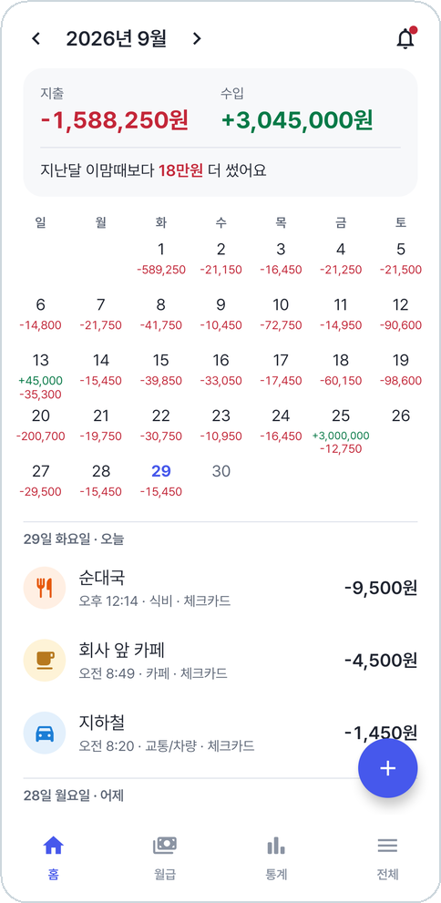&nbsp;&nbsp;
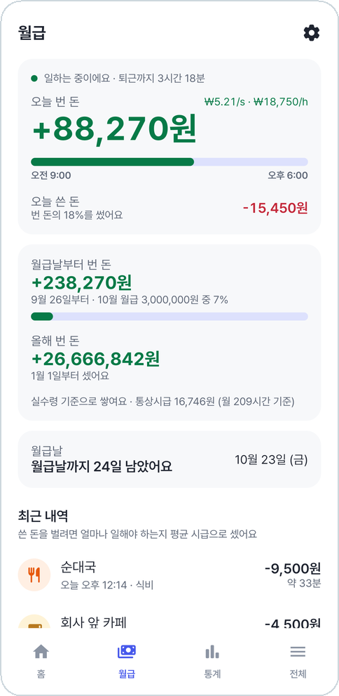&nbsp;&nbsp;
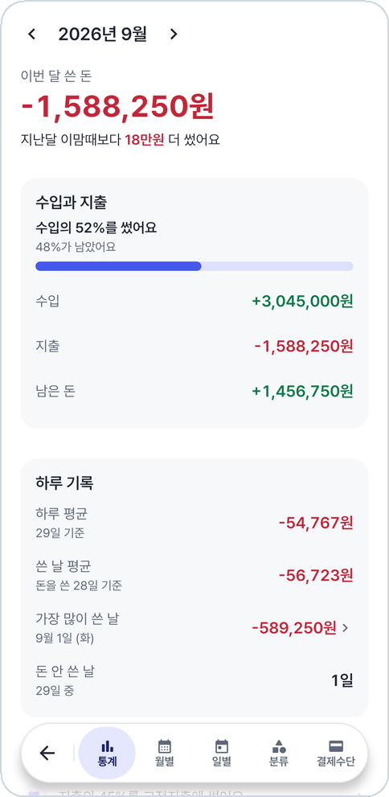

---

카드를 긁거나 카카오페이로 내면 알림이 온다. 동계부는 그 알림을 읽고 "가계부에 등록할까요?" 하고 묻는다.
누르면 금액·카드·가게가 채워진 등록창이 열려서, 확인만 누르면 끝이다.
기록은 전부 폰 안에만 남고 어디로도 보내지 않는다.

- 🔔 **결제 알림으로 등록** — 토스·카카오페이 결제 알림이 오면 바로 묻고, 같은 가게면 지난번 분류를 골라 둔다
- 📅 **달력 홈** — 날마다 쓴 돈과 들어온 돈, 지난달 이맘때보다 얼마나 더(덜) 썼는지
- 📊 **통계** — 한눈에 · 월별 · 일별 · 분류 · 결제수단
- 💰 **실시간 월급** — 일하는 동안 오늘 번 돈이 초마다 올라간다. PIN·지문으로 잠근다
- 🗂️ **분류 · 결제수단** — 아이콘과 색을 고르고, 길게 눌러 순서를 바꾼다
- 💾 **백업 · 복원** — JSON으로 복사하거나 파일로 저장했다가 그대로 되살린다

## 결제 알림으로 바로 등록

<table>
<tr>
<td align="center" width="33%">
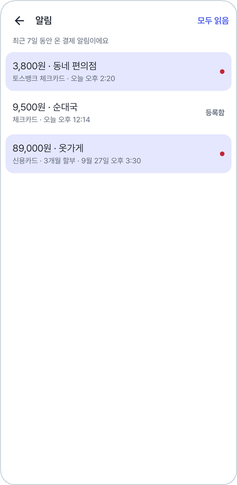 
<b>지난 7일 동안 온 결제 알림</b>
</td>
<td align="center" width="33%">
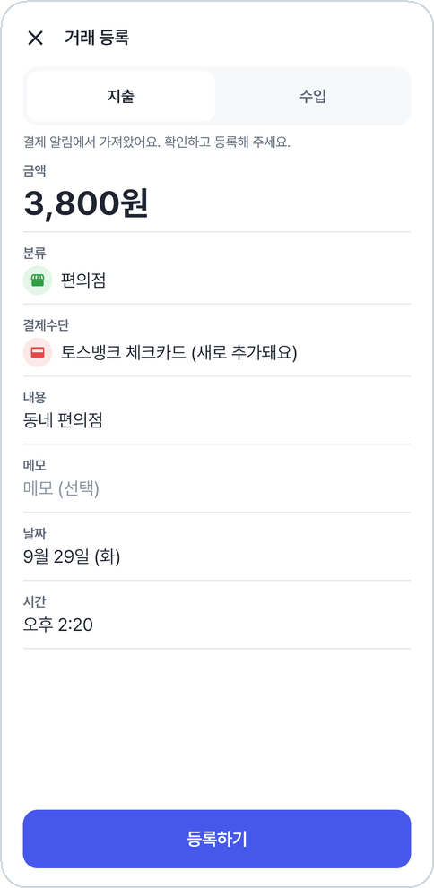 
<b>금액·카드·가게·시각이 채워져 열린다</b>
</td>
<td align="center" width="33%">
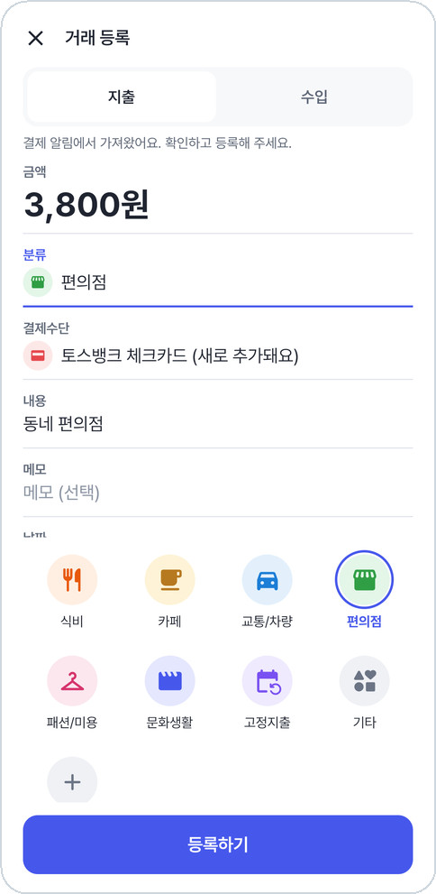 
<b>분류는 아이콘을 눌러 고른다</b>
</td>
</tr>
</table>

처음 보는 카드는 결제수단에 새로 추가되고, 할부는 메모에 적힌다. 같은 결제를 두 번 등록하려고 하면 알려준다.

## 홈과 거래 상세

<table>
<tr>
<td align="center" width="50%">
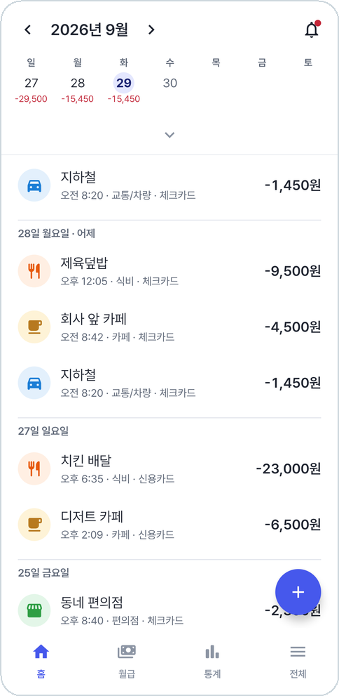 
<b>내려 보면 한 주 달력이 위에 붙는다</b>
</td>
<td align="center" width="50%">
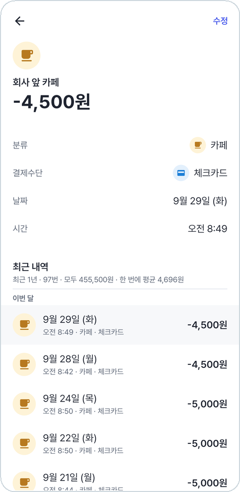 
<b>같은 곳에서 쓴 내역을 1년까지 모아 본다</b>
</td>
</tr>
</table>

## 통계

첫 칸 '통계'에서 이번 달을 한눈에 보고, 아래 메뉴로 월별·일별·분류·결제수단을 오간다.

<table>
<tr>
<td align="center" width="33%">
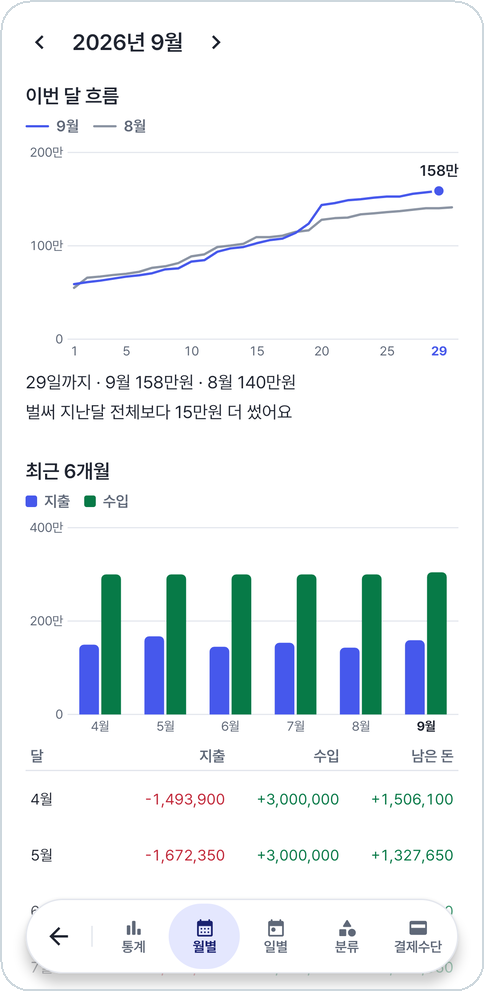 
<b>월별 흐름 · 최근 6개월</b>
</td>
<td align="center" width="33%">
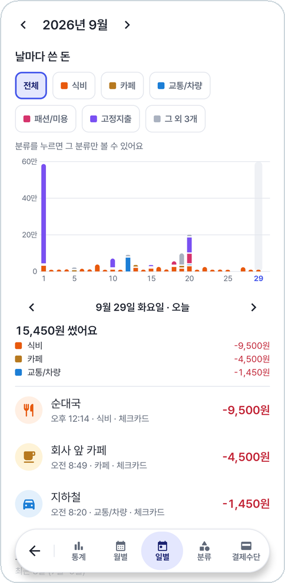 
<b>날마다 쓴 돈을 분류 색으로</b>
</td>
<td align="center" width="33%">
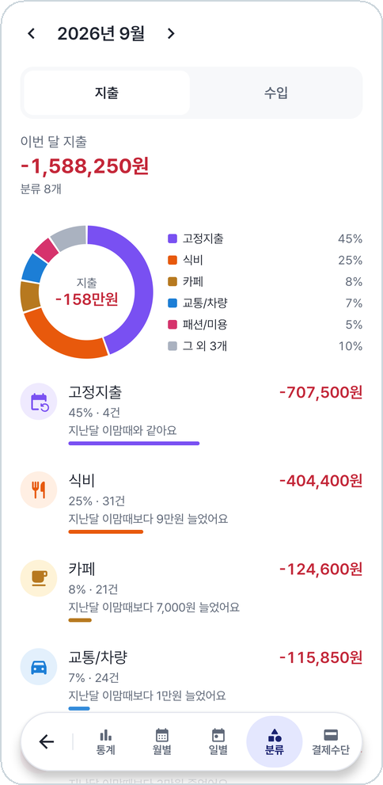 
<b>분류별 비율 · 지난달 대비</b>
</td>
</tr>
</table>

## 월급

연봉이나 월급과 출퇴근 시간을 정해 두면, 일하는 동안 오늘 번 돈이 초마다 올라간다.
점심시간은 빼고 센다. 월급날부터 번 돈과 올해 번 돈, 1초·1시간에 버는 돈, 통상시급을 보여 주고,
월급날에는 '월급 들어왔나요?' 알림을 띄워 누르면 바로 수입으로 등록한다.

<table>
<tr>
<td align="center" width="33%">
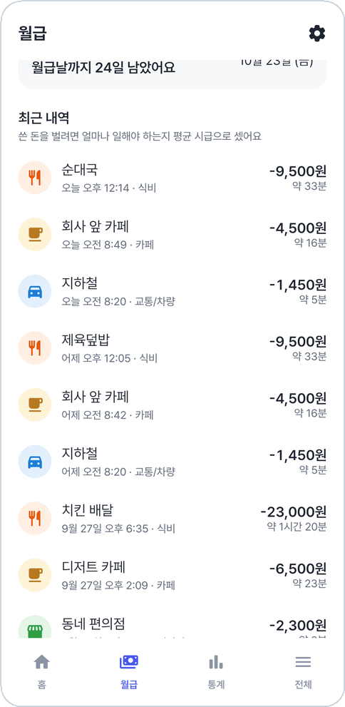 
<b>쓴 돈을 일한 시간으로</b>
</td>
<td align="center" width="33%">
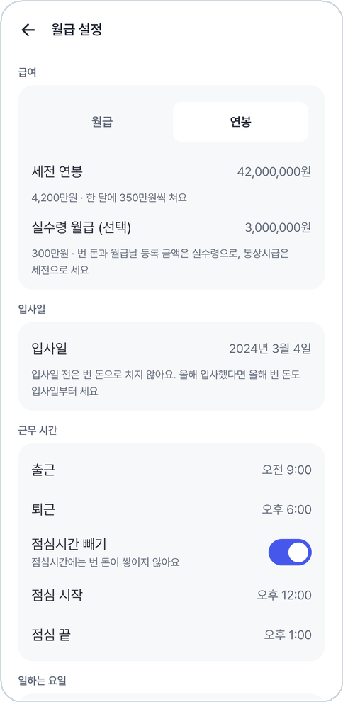 
<b>세전 · 실수령 · 근무 시간 · 월급날</b>
</td>
<td align="center" width="33%">
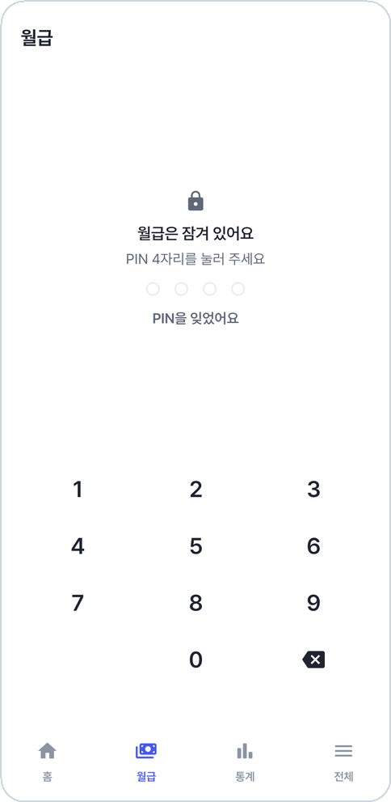 
<b>PIN 4자리나 지문으로 잠금</b>
</td>
</tr>
</table>

## 분류 관리와 설정

<table>
<tr>
<td align="center" width="33%">
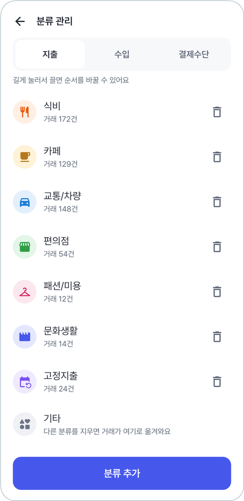 
<b>아이콘과 색, 길게 눌러 순서 바꾸기</b>
</td>
<td align="center" width="33%">
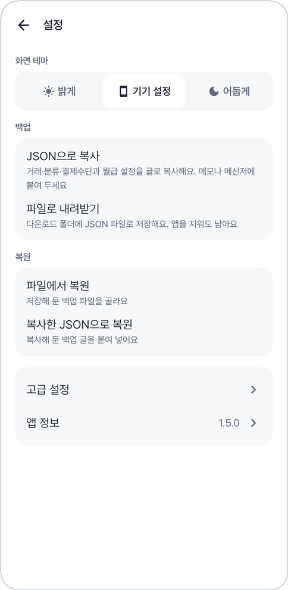 
<b>화면 테마 · 백업 · 복원</b>
</td>
<td align="center" width="33%">
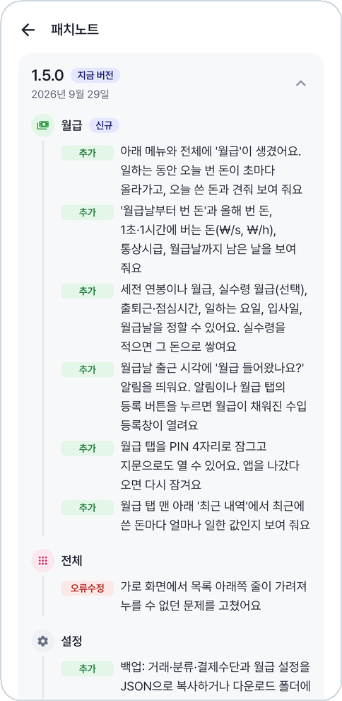 
<b>버전마다 바뀐 점</b>
</td>
</tr>
</table>

새 버전이 나오면 앱이 알려 주고, 앱 안에서 바로 받아 설치한다.

## 어두운 테마

<table>
<tr>
<td align="center" width="33%">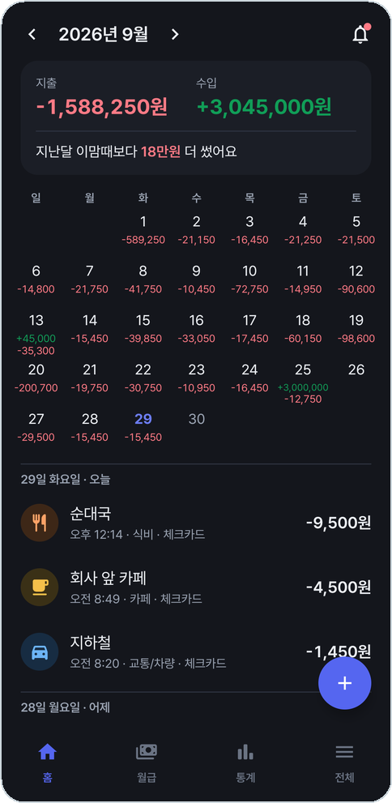</td>
<td align="center" width="33%">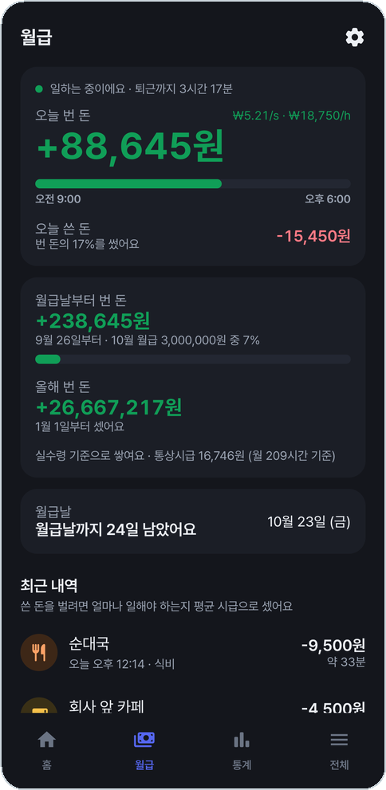</td>
<td align="center" width="33%">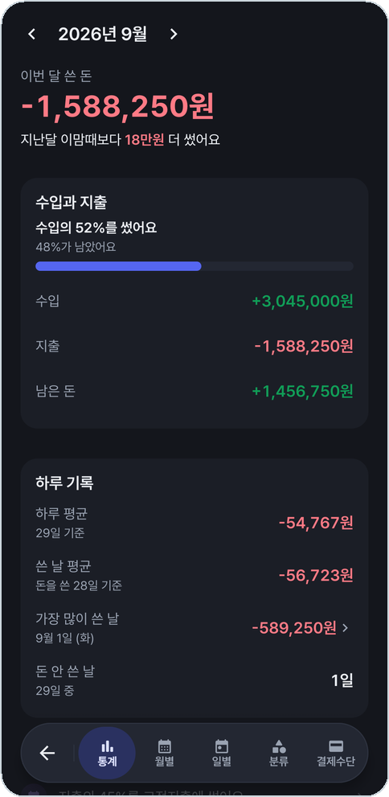</td>
</tr>
</table>

## 설치

**Android 12 이상.** [Releases](https://github.com/ldg030201/dong-budget/releases/latest)에서 APK를 받아 설치한다.
그다음부터는 앱 안에서 업데이트한다.

결제 알림으로 등록하려면 앱을 처음 켤 때 **알림 읽기**를 허용한다.
토스·카카오페이 결제 알림만 골라 읽고, 다른 앱의 알림은 저장하거나 어디로 보내지 않는다.

## 라이선스

[MIT](LICENSE). 앱에 들어 있는 Pretendard 폰트는 SIL Open Font License 1.1을 따른다([NOTICE](NOTICE)).

> 토스(비바리퍼블리카)·카카오페이와 무관한 개인 앱이다. 화면의 거래와 금액은 모두 예시다.
