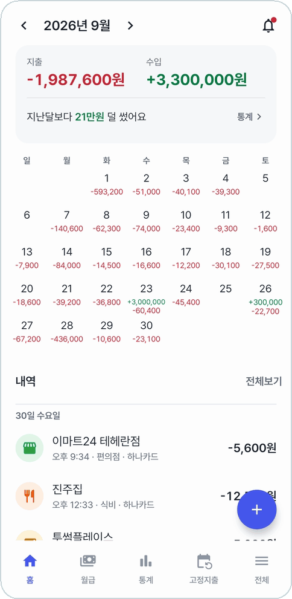
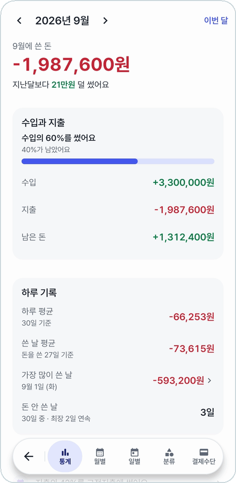
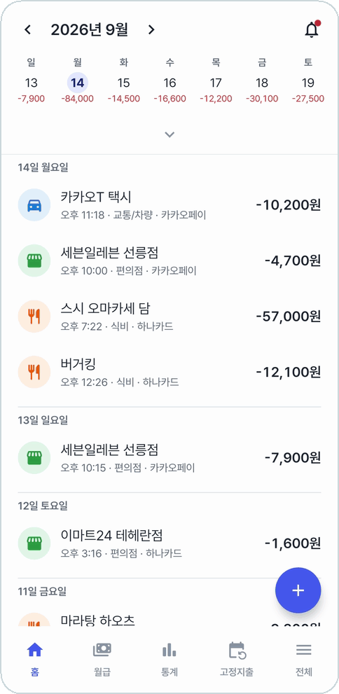
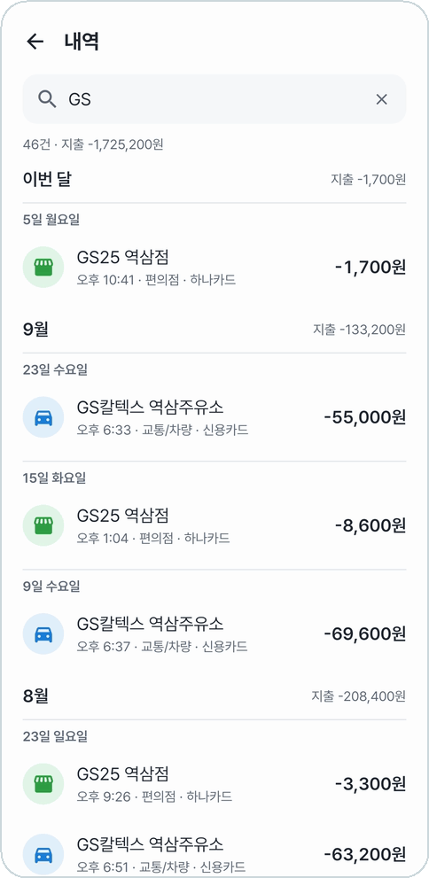
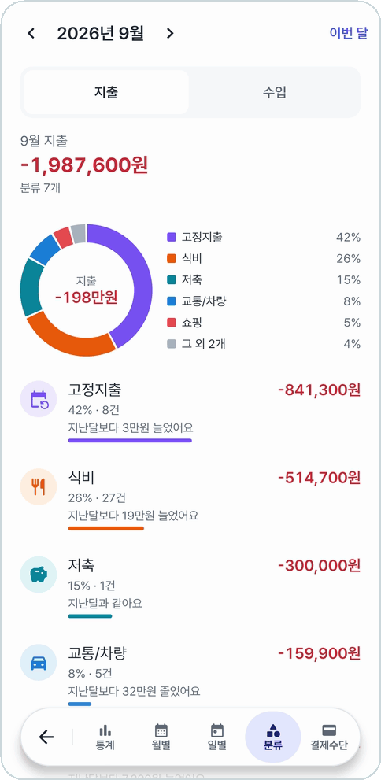

# 동계부

**토스·카카오페이 결제 알림을 읽어 알아서 적어 주는 개인 가계부**

&nbsp;&nbsp;
&nbsp;&nbsp;

---

카드를 긁거나 카카오페이로 내면 알림이 온다. 동계부는 그 알림을 읽고 "가계부에 등록할까요?" 하고 묻는다.
누르면 금액·카드·가게가 채워진 등록창이 열려서, 확인만 누르면 끝이다.
기록은 전부 폰 안에만 남고 어디로도 보내지 않는다.

- 🔔 **[결제 알림으로 등록](docs/guide/capture.md)** — 토스·카카오페이 결제 알림이 오면 바로 묻고, 같은 가게면 지난번 분류를 골라 둔다
- 📅 **[달력 홈](docs/guide/home.md)** — 날마다 쓴 돈과 들어온 돈, 지난달 이맘때보다 얼마나 더(덜) 썼는지
- 🔎 **[내역](docs/guide/history.md)** — 모든 거래를 모아 보고 가게·분류·금액으로 찾는다
- 💰 **[실시간 월급](docs/guide/salary.md)** — 일하는 동안 오늘 번 돈이 초마다 올라간다. PIN·지문으로 잠근다
- 📊 **[통계](docs/guide/statistics.md)** — 한눈에 · 월별 · 일별 · 분류 · 결제수단
- 🗓️ **[고정지출](docs/guide/fixed-expenses.md)** — 매달 나가는 돈을 이번 달에 냈는지. 날짜와 금액은 지난 기록으로 짐작한다
- 💳 **[카드실적](docs/guide/card-performance.md)** — 카드마다 다음 실적 구간까지 얼마 더 쓰면 되는지
- 🗂️ **[분류 관리](docs/guide/categories.md)** · ⚙️ **[설정](docs/guide/settings.md)** — 아이콘과 색, 아래 메뉴 차림, 백업 · 복원, 앱 잠금

## 메뉴별 안내

사진을 누르면 메뉴마다 자세한 안내로 간다.

<table>
<tr>
<td align="center" width="33%" valign="top">
 
<b><a href="docs/guide/capture.md">결제 알림으로 등록</a></b> 
알림을 누르면 채워진 등록창
</td>
<td align="center" width="33%" valign="top">
 
<b><a href="docs/guide/home.md">홈</a></b> 
요약 · 달력 · 날짜별 내역
</td>
<td align="center" width="33%" valign="top">
 
<b><a href="docs/guide/transaction.md">거래 등록 · 상세</a></b> 
같은 곳에서 쓴 내역을 1년까지
</td>
</tr>
<tr>
<td align="center" width="33%" valign="top">
 
<b><a href="docs/guide/history.md">내역</a></b> 
모든 거래를 모아 보고 찾기
</td>
<td align="center" width="33%" valign="top">
 
<b><a href="docs/guide/salary.md">월급</a></b> 
쓴 돈을 일한 시간으로
</td>
<td align="center" width="33%" valign="top">
 
<b><a href="docs/guide/statistics.md">통계</a></b> 
분류 · 결제수단별 비율과 순위
</td>
</tr>
<tr>
<td align="center" width="33%" valign="top">
 
<b><a href="docs/guide/fixed-expenses.md">고정지출</a></b> 
이번 달 냈는지, 놓쳤는지
</td>
<td align="center" width="33%" valign="top">
 
<b><a href="docs/guide/card-performance.md">카드실적</a></b> 
다음 구간까지 남은 돈
</td>
<td align="center" width="33%" valign="top">
 
<b><a href="docs/guide/categories.md">분류 관리</a></b> 
길게 눌러 순서 바꾸기
</td>
</tr>
<tr>
<td align="center" width="33%" valign="top">
 
<b><a href="docs/guide/settings.md">전체 · 설정</a></b> 
하단 메뉴 · 백업 · 잠금 · 업데이트
</td>
<td align="center" width="33%" valign="top">
 
<b><a href="docs/guide/settings.md#어두운-테마">어두운 테마</a></b> 
밝게 · 기기 설정 · 어둡게
</td>
<td></td>
</tr>
</table>

## 설치

**Android 12 이상.** [Releases](https://github.com/ldg030201/dong-budget/releases/latest)에서 APK를 받아 설치한다.
그다음부터는 앱 안에서 업데이트한다.

1. **(갤럭시)** 설정 → 보안 및 개인정보 보호 → **자동 차단**을 끈다. 켜져 있으면 스토어 밖 앱의 설치와 업데이트가 막힌다.
2. 브라우저에서 APK를 받고 알 수 없는 출처 설치를 허용한다.
3. 앱을 처음 켜면 **알림 읽기**를 허용한다. '제한된 설정' 창이 뜨면 [이렇게](docs/guide/capture.md#처음-켤-때-알림-읽기-허용) 푼다.
4. 토스로 카드 결제 알림을 받으려면 토스 앱에서 **카드 알림 받기**를 켠다(하나·우리·롯데·KB국민·BC·토스뱅크 카드).

토스·카카오페이 결제 알림만 골라 읽고, 다른 앱의 알림은 저장하거나 어디로 보내지 않는다.

## 라이선스

[MIT](LICENSE). 앱에 들어 있는 Pretendard 폰트는 SIL Open Font License 1.1을 따른다([NOTICE](NOTICE)).

> 토스(비바리퍼블리카)·카카오페이와 무관한 개인 앱이다. 화면의 거래와 금액은 모두 예시다.
