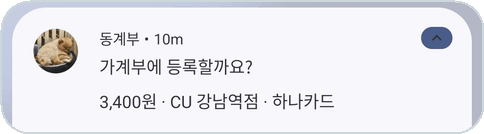
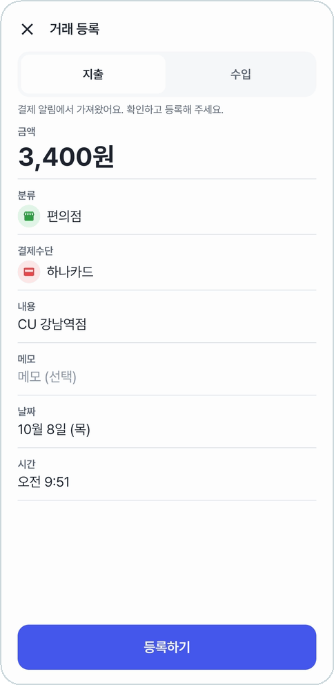
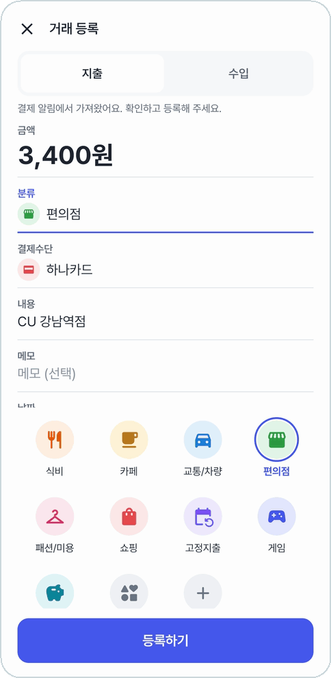
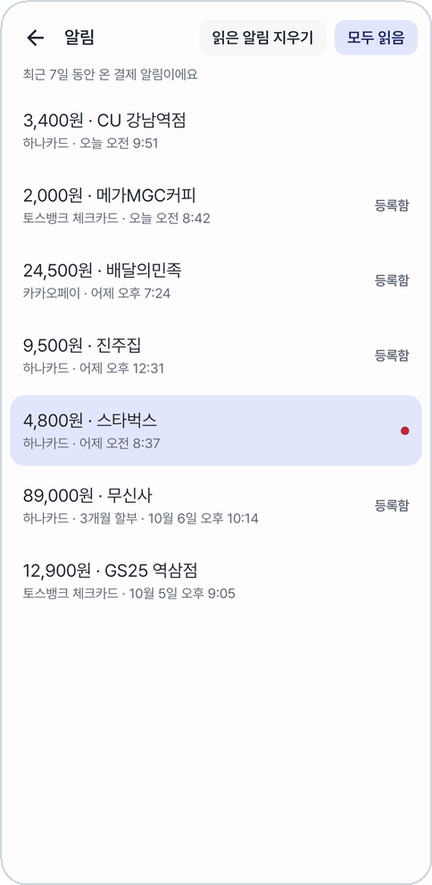
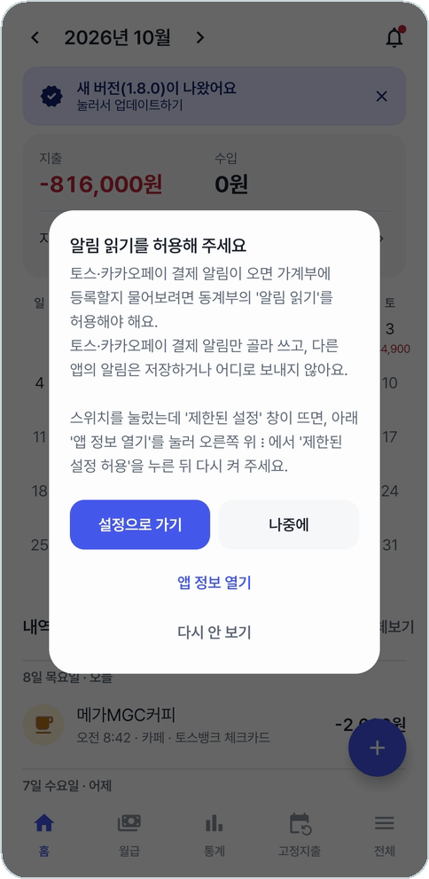

# 결제 알림으로 등록

카드를 긁거나 카카오페이로 내면 폰에 결제 알림이 온다. 동계부는 그 알림을 읽고 "가계부에 등록할까요?" 하고 묻는다.
누르면 금액·카드·가게·시각이 채워진 등록창이 열려서, 확인하고 **등록하기**만 누르면 끝이다.

## 알림을 누르면 채워진 등록창

<table>
<tr>
<td align="center" width="33%">
 
<b>금액·카드·가게·시각이 채워져 열린다</b>
</td>
<td align="center" width="33%">
 
<b>같은 가게면 지난번 분류를 골라 둔다</b>
</td>
<td align="center" width="33%">
 
<b>홈의 종을 누르면 지난 7일 결제 알림</b>
</td>
</tr>
</table>

- **같은 가게면 지난번 분류**를 골라 둔다. 처음 가는 곳이면 분류만 골라 주면 된다.
- **처음 보는 카드**는 등록할 때 결제수단에 새로 추가된다. 카카오페이로 낸 결제는 결제수단이 '카카오페이'다.
- **할부**는 메모에 '3개월 할부'처럼 적어 둔다.
- 토스는 결제 한 건을 알림 두 개로 보내기도 하고, 카카오페이로 낸 결제의 카드 알림이 토스로도 온다.
  **금액이 같고 5초 안에 온 알림은 같은 결제**로 보고 한 번만 묻는다.
- 이미 등록한 결제를 또 등록하려고 하면 알려 준다.

## 알림 목록

홈 오른쪽 위 **종**을 누르면 최근 7일 동안 온 결제 알림이 모여 있다. 알림창에서 지워 버린 결제도 여기서 다시 등록할 수 있다.

- 아직 안 본 알림은 바탕색과 빨간 점으로 표시되고, 종에도 빨간 점이 뜬다.
- 등록을 마친 결제에는 **등록함**이 붙는다.
- **모두 읽음**은 표시를 지우고 알림창에 남은 등록 알림도 함께 치운다. **읽은 알림 지우기**는 눌러 봤거나 등록한 알림만 목록에서 지운다.
- 앱이 꺼져 있던 사이 온 결제 알림이 알림창에 남아 있으면, 앱을 열 때 다시 살펴서 묻는다.

## 읽는 알림

| 앱 | 읽는 알림 |
|---|---|
| 토스 | 카드 결제 알림(하나·우리·롯데·KB국민·BC·토스뱅크 카드). 토스 앱에서 **카드 알림 받기**를 켜 둬야 온다 |
| 카카오페이 | '결제가 완료되었어요' 결제 알림 |

토스·카카오페이 결제 알림만 골라 읽고, **다른 앱의 알림은 저장하거나 어디로 보내지 않는다.** 읽은 결제도 폰 안에만 남는다.

## 처음 켤 때 알림 읽기 허용

<table>
<tr>
<td align="center" width="40%">
 
<b>앱을 처음 켜면 알림 읽기를 허용해 달라고 묻는다</b>
</td>
<td width="60%">

**설정으로 가기**를 눌러 동계부 스위치를 켠다.

브라우저로 받아 설치한 폰은 스위치를 누르면 **'제한된 설정'** 창이 뜨면서 막힐 수 있다.
그때는 안내창의 **앱 정보 열기** → 오른쪽 위 ⋮ → **제한된 설정 허용**을 누른 뒤 다시 켠다.

나중에 켜려면 **전체 → 설정 → 권한**에서 켜져 있는지 보고 바로 켜러 갈 수 있다.

</td>
</tr>
</table>

## 끄고 싶을 때

**전체 → 설정 → 고급 설정**에서 하나씩 끌 수 있다. 처음에는 모두 켜져 있다.

- 결제 알림: 등록할지 묻기 · 같은 결제 알림은 한 번만 묻기 · 앱을 열 때 놓친 알림 다시 살피기
- 알림으로 등록할 때: 같은 가게면 지난 분류 고르기 · 카드 이름으로 결제수단 고르기 · 없는 카드는 새로 추가하기 · 할부는 메모에 적기

---

[목차](../../README.md#메뉴별-안내) · [다음: 홈 →](home.md)
