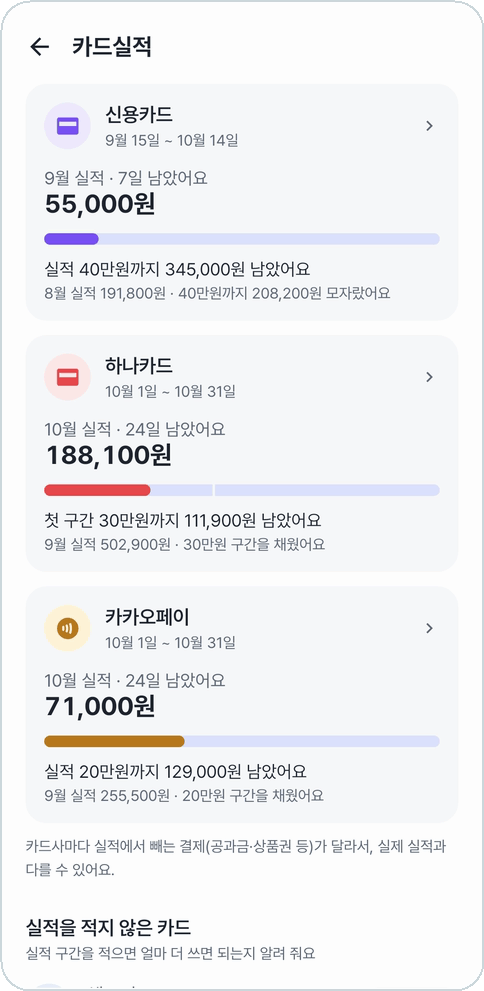
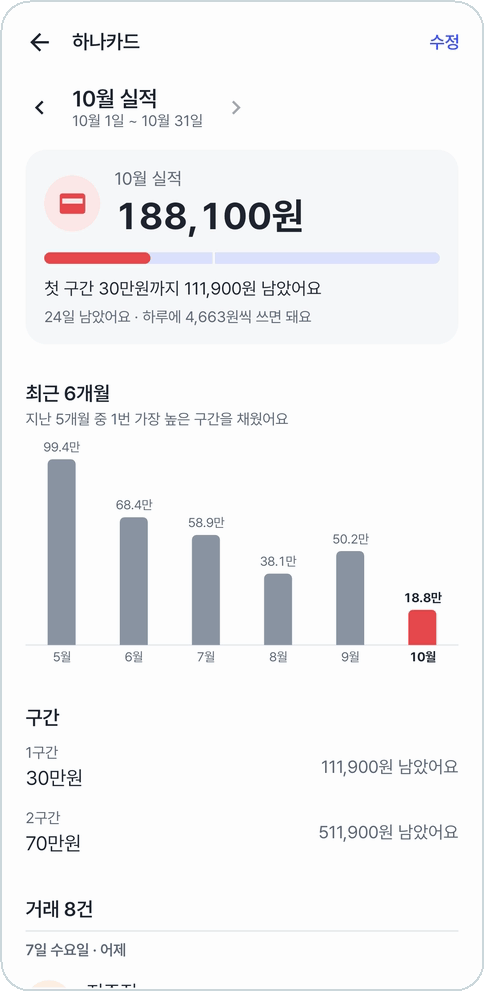
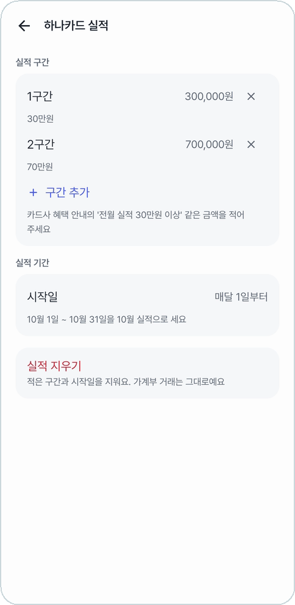
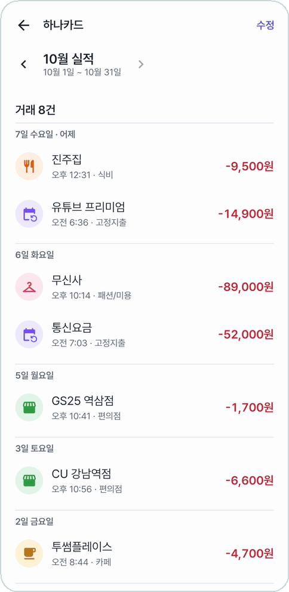

# 카드실적

카드사 혜택의 '전월 실적 30만원 이상' 같은 구간을 적어 두면, 이번 달에 얼마 썼고 **다음 구간까지 얼마 더 쓰면 되는지** 보여 준다.

<table>
<tr>
<td align="center" width="33%">
 
<b>카드마다 이번 기간 실적과 남은 돈</b>
</td>
<td align="center" width="33%">
 
<b>하루에 얼마씩 쓰면 되는지 · 최근 6개월</b>
</td>
<td align="center" width="33%">
 
<b>구간은 5개까지, 시작일도 카드마다</b>
</td>
</tr>
</table>

## 카드 목록

- 현금·계좌이체를 뺀 결제수단이 모두 나온다. 결제 알림으로 생긴 카드도 들어간다.
- 카드마다 이번 기간(예: 10월 1일 ~ 10월 31일)에 쓴 돈, 남은 날, 구간 표시가 있는 막대.
- **첫 구간 30만원까지 111,900원 남았어요**, **30만원 구간을 채웠어요 · 70만원까지 …** 처럼 알려 준다.
- 아래 줄은 지난 기간 결과: **9월 실적 502,900원 · 30만원 구간을 채웠어요**
- 실적을 아직 안 적은 카드는 맨 아래 **실적을 적지 않은 카드**에 있고, **실적 추가**로 적는다.

## 상세

카드를 누르면 연다.

<table>
<tr>
<td align="center" width="50%">
 
<b>그 기간에 그 카드로 쓴 거래</b>
</td>
<td width="50%">

- 맨 위: 이번 기간 실적, 다음 구간까지 남은 돈, **하루에 4,663원씩 쓰면 돼요**
- **최근 6개월**: 기간마다 실적 막대와 가장 높은 구간을 몇 번 채웠는지
- **구간**: 구간마다 남은 돈
- **거래**: 그 기간 그 카드로 쓴 거래
- **‹ ›** 로 지난 기간을 본다
- 오른쪽 위 **수정**으로 구간과 시작일을 고친다

</td>
</tr>
</table>

## 구간과 시작일

- **실적 구간**: '30만원', '70만원'처럼 5개까지.
- **시작일**: 실적을 세기 시작하는 날(매달 1~31일). 15일이면 9월 15일 ~ 10월 14일을 '9월 실적'으로 센다. 그 달에 없는 날이면 말일부터.
- **실적 지우기**: 적은 구간과 시작일만 지운다. 거래는 그대로다.

환불받은 돈이 더 많으면 실적이 '+'로 보인다.
카드사마다 실적에서 빼는 결제(공과금·상품권 등)가 달라서 실제 실적과 다를 수 있다.

---

[← 이전: 고정지출](fixed-expenses.md) · [목차](../../README.md#메뉴별-안내) · [다음: 분류 관리 →](categories.md)
