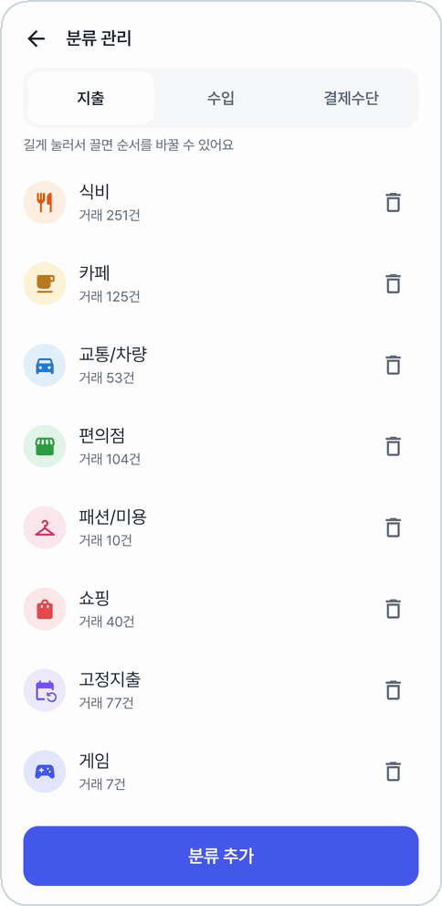
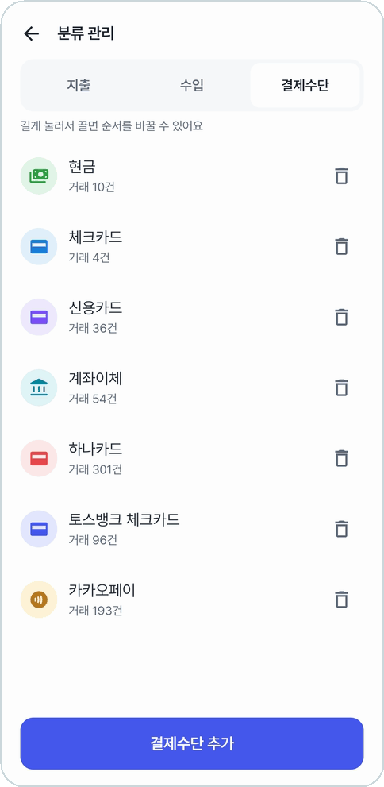
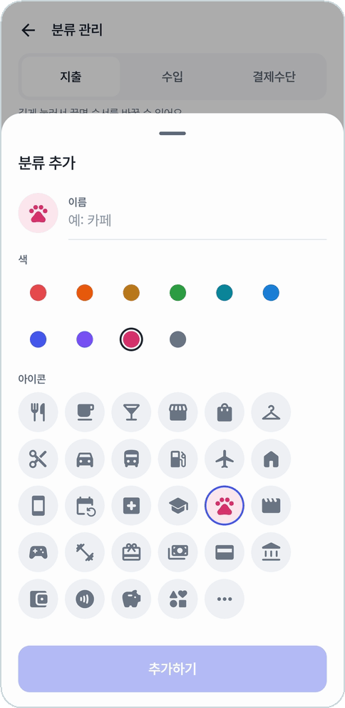

# 분류 관리

**전체 → 분류 관리**. 지출 분류, 수입 분류, 결제수단을 더하고 지우고 순서를 바꾼다.

<table>
<tr>
<td align="center" width="33%">
 
<b>분류마다 거래 몇 건인지</b>
</td>
<td align="center" width="33%">
 
<b>결제수단도 같은 방식으로</b>
</td>
<td align="center" width="33%">
 
<b>이름 · 색 10가지 · 아이콘 29가지</b>
</td>
</tr>
</table>

- 위에서 **지출 · 수입 · 결제수단**을 고른다.
- **길게 눌러 끌면** 순서를 바꾼다. 바꾼 순서는 거래 등록의 아이콘 표에도 그대로 나온다.
- **휴지통**으로 지운다.
  - 분류를 지우면 그 분류로 적은 거래는 '기타'로 옮겨진다. '기타'는 지울 수 없다.
  - 결제수단을 지우면 그 거래의 결제수단 칸만 비워진다.
- **분류 추가 / 결제수단 추가**: 이름(20자까지), 색, 아이콘을 고른다. 아직 안 쓴 색을 먼저 골라 둔다.

## 처음 들어 있는 것

| 묶음 | 기본 |
|---|---|
| 지출 | 식비 · 교통/차량 · 편의점 · 패션/미용 · 고정지출 · 게임 · 저축 · 기타 |
| 수입 | 급여 · 용돈 · 기타 |
| 결제수단 | 현금 · 체크카드 · 신용카드 · 계좌이체 |

- **고정지출** 분류로 적은 지출은 [고정지출](fixed-expenses.md) 메뉴가 모아 본다.
- **급여** 분류는 [월급](salary.md)날 알림으로 등록하는 수입이 쓴다.
- 결제 알림에서 처음 보는 카드(하나카드, 카카오페이 등)는 등록할 때 결제수단에 저절로 추가된다.

---

[← 이전: 카드실적](card-performance.md) · [목차](../../README.md#메뉴별-안내) · [다음: 설정 →](settings.md)
