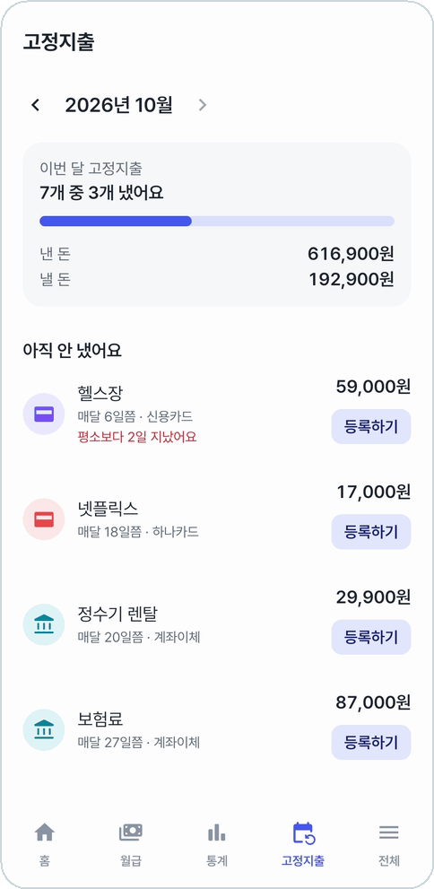
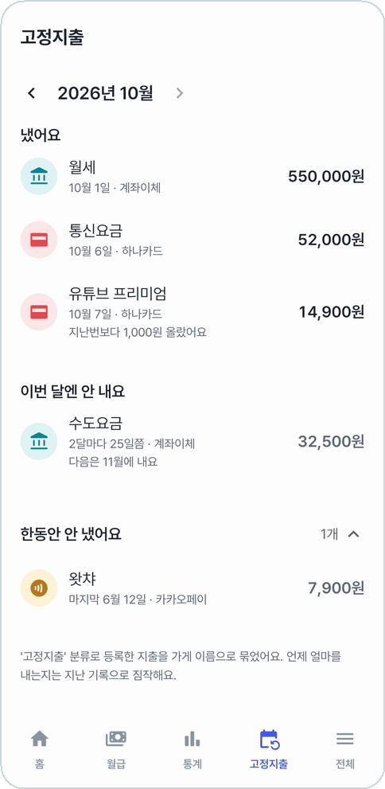
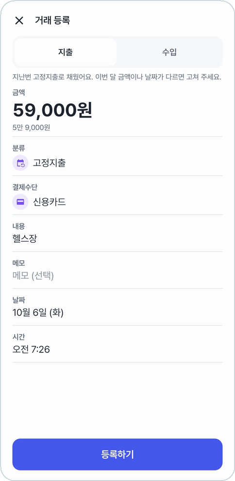

# 고정지출

월세·통신요금·구독료처럼 매달 나가는 돈을 **이번 달에 냈는지** 한눈에 본다.
'고정지출' 분류로 등록한 지출을 가게 이름별로 모으고, 언제 얼마를 내는지는 지난 기록으로 짐작한다. 따로 정해 둘 것이 없다.

<table>
<tr>
<td align="center" width="33%">
 
<b>몇 개 냈는지, 낸 돈과 낼 돈</b>
</td>
<td align="center" width="33%">
 
<b>냈어요 · 이번 달엔 안 내요 · 한동안 안 냈어요</b>
</td>
<td align="center" width="33%">
 
<b>'등록하기'는 지난번 값으로 채운 등록창</b>
</td>
</tr>
</table>

## 묶음

| 묶음 | 뜻 |
|---|---|
| 아직 안 냈어요 | 이번 달 낼 차례인데 아직 기록이 없다. 줄마다 **등록하기** 버튼 |
| 냈어요 | 이번 달 몫을 냈다 |
| 이번 달엔 안 내요 | 2달마다·매년 내는 것 중 이번 달은 차례가 아닌 것 |
| 한동안 안 냈어요 | 해지했거나 끊긴 것. 접혀 있다 |

맨 위에는 '7개 중 3개 냈어요'와 낸 돈·낼 돈을 막대로 보여 준다. **‹** 로 지난 달도 본다.

## 줄에 붙는 말

- 언제 내는지: **매달 6일쯤**, **2달마다 25일쯤**, **매년 3월 25일쯤**, 한 달에 두 번이면 **매달 3일, 28일쯤**, 자주 내는 곳은 **한 달에 13번쯤**
- **평소보다 2일 지났어요**(빨강): 낼 날이 지났는데 기록이 없다
- **오늘 낼 차례예요**
- **9월 차례도 안 냈어요**: 지난 차례를 놓쳤다
- **지난번보다 1,000원 올랐어요 / 내렸어요**
- **다음은 11월에 내요**
- **3월 몫을 2월 22일에 미리 냈어요**
- **2번 중 1번 냈어요**: 한 달 몫을 나눠 내거나, 두 회선 중 하나만 나갔다

평소 날짜가 **주말이나 공휴일**이면 다음 영업일을 낼 날로 본다(공휴일 달력이 들어 있다).
그래서 연휴 때문에 밀려 나가는 것을 '지났어요'로 잘못 알리지 않는다.

## 등록하기

**아직 안 냈어요** 줄의 **등록하기**를 누르면 지난번 금액·결제수단·가게로 채운 등록창이 열린다.
이번 달 금액이나 날짜가 다르면 고쳐서 등록한다.

줄을 누르면 그 가게의 가장 최근 거래 상세가 열리고, 거기서 최근 1년 동안 낸 내역을 본다.

## 쓰는 법

- 매달 나가는 지출을 등록할 때 분류를 **고정지출**로 고른다. 몇 달 쌓이면 알아서 묶이고 날짜를 짐작한다.
- 가게 이름(내용)이 같아야 하나로 묶인다.
- '고정지출' 분류를 지웠다가 같은 이름으로 다시 만들면 다시 알아본다.

---

[← 이전: 통계](statistics.md) · [목차](../../README.md#메뉴별-안내) · [다음: 카드실적 →](card-performance.md)
