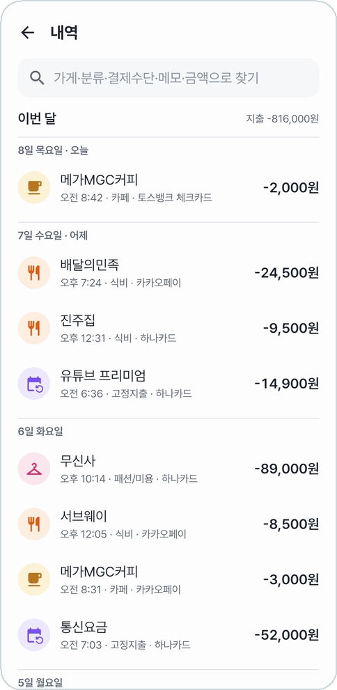

# 내역

모든 달의 거래를 최근 것부터 한 줄로 모아 보고, 가게·금액으로 찾는다.

<table>
<tr>
<td align="center" width="50%">
 
<b>모든 거래를 달·날짜별로</b>
</td>
<td align="center" width="50%">
 
<b>찾은 건수와 합계도 알려 준다</b>
</td>
</tr>
</table>

- 달 이름과 그 달에 쓴 돈·들어온 돈은 스크롤해도 위에 붙어 있다.
- 맨 위 검색칸에 **가게·분류·결제수단·메모·금액**을 적으면 맞는 거래만 남는다.
  - 금액은 `45000`이든 `45,000`이든 된다.
  - 빈칸으로 나눠 여러 낱말을 적으면 모두 맞는 거래만 나온다. 예: `배달 카카오페이`
  - '지출'·'수입'·'환불'로 거래 종류도 찾는다.
- 줄을 누르면 [거래 상세](transaction.md#거래-상세)가 열린다.

## 여는 곳

처음에는 아래 메뉴에 없다.

- 홈 내역 오른쪽의 **전체보기**
- **전체 → 내역**
- 자주 쓰면 **설정 → 하단 메뉴**에서 아래 메뉴에 넣는다([하단 메뉴](settings.md#하단-메뉴))

---

[← 이전: 거래 등록 · 상세](transaction.md) · [목차](../../README.md#메뉴별-안내) · [다음: 월급 →](salary.md)
