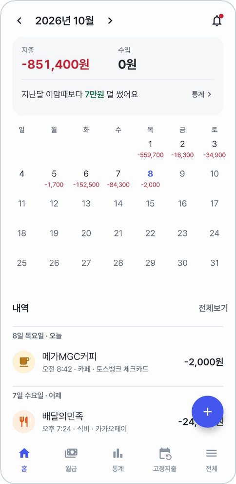
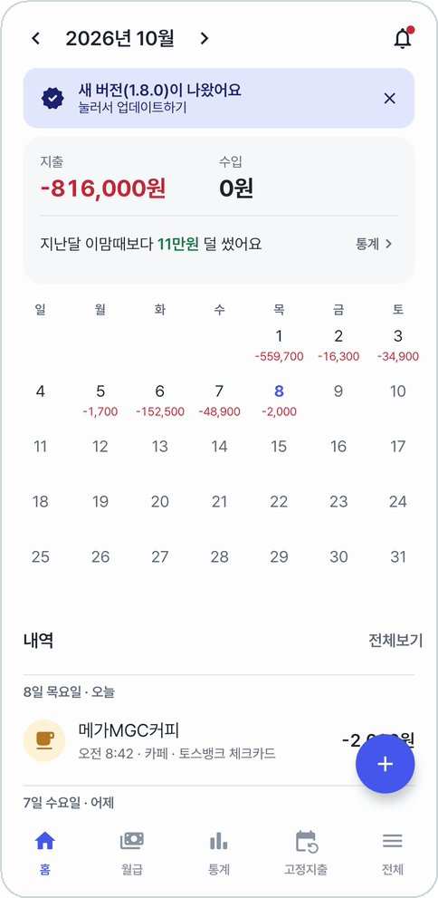
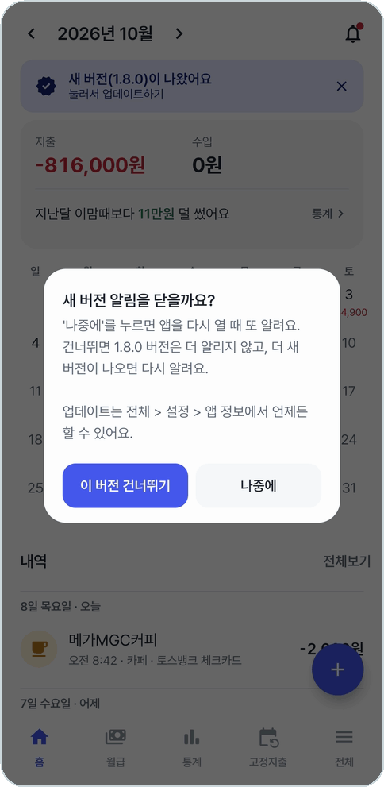

# 홈

앱을 열면 보이는 첫 화면. 이번 달에 얼마 쓰고 얼마 들어왔는지, 날마다 얼마 썼는지를 달력으로 본다.

<table>
<tr>
<td align="center" width="33%">
 
<b>요약과 달력. 날마다 쓴 돈·들어온 돈</b>
</td>
<td align="center" width="33%">
 
<b>달력 아래에 날짜별 내역</b>
</td>
<td align="center" width="33%">
 
<b>날짜를 누르면 그날로 내려가고 한 주 줄이 위에 붙는다</b>
</td>
</tr>
</table>

## 요약

- 맨 위 **‹ ›** 로 달을 넘긴다.
- 그 달의 **지출**(빨강, -)과 **수입**(초록, +).
- **지난달 이맘때보다 7만원 덜 썼어요**처럼 지난달 같은 날까지와 견줘 알려 준다. 지난 달을 보면 '지난달보다'로 한 달 전체를 견준다.
- 그 줄의 **통계 >** 를 누르면 보던 달의 [통계](statistics.md)로 간다.

## 달력

- 날마다 쓴 돈과 들어온 돈이 적힌다. 오늘은 파란 숫자다.
- **날짜를 누르면** 아래 내역이 그날로 내려간다. 내려 보면 그 주 한 줄만 위에 붙어 있고, **⌄** 를 누르면 다시 한 달이 펼쳐진다.
- 한 주를 일요일부터 볼지 월요일부터 볼지는 **설정 → 한 주 시작**에서 고른다.

## 내역

- 그 달 거래가 날짜별로 최근 것부터 늘어선다. 줄을 누르면 [거래 상세](transaction.md#거래-상세)가 열린다.
- **전체보기**를 누르면 모든 달의 거래를 모아 보고 찾는 [내역](history.md)으로 간다.
- 오른쪽 아래 **+** 로 [거래를 직접 등록](transaction.md)한다.
- 오른쪽 위 **종**은 [결제 알림 목록](capture.md#알림-목록)이다.

## 새 버전 알림

<table>
<tr>
<td align="center" width="50%">
 
<b>새 버전이 나오면 맨 위에 줄이 생긴다</b>
</td>
<td align="center" width="50%">
 
<b>X 를 누르면 '나중에'나 '이 버전 건너뛰기'</b>
</td>
</tr>
</table>

줄을 누르면 [앱 정보](settings.md#앱-정보와-업데이트)에서 바로 받아 설치한다. 건너뛴 버전은 다시 알리지 않고, 더 새 버전이 나오면 그때 알린다.

---

[← 이전: 결제 알림으로 등록](capture.md) · [목차](../../README.md#메뉴별-안내) · [다음: 거래 등록 · 상세 →](transaction.md)
