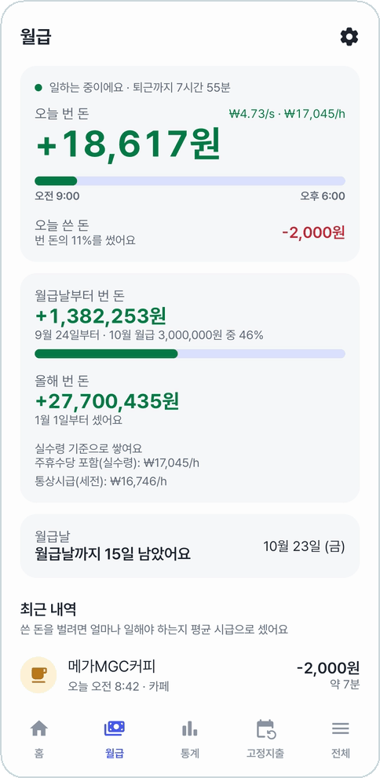
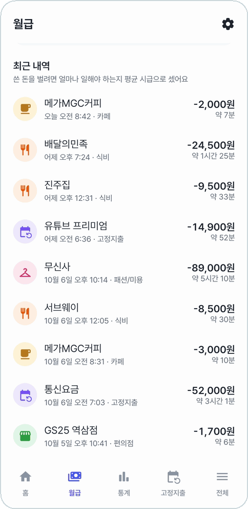
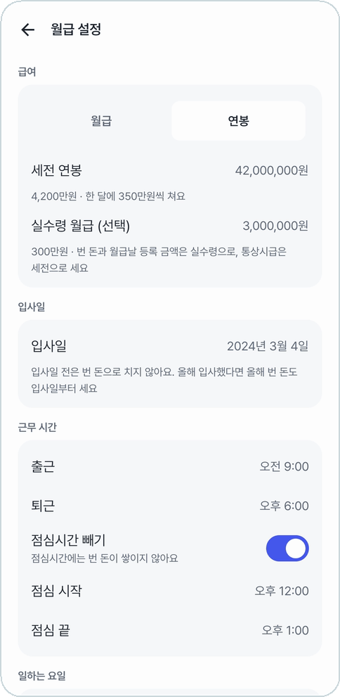
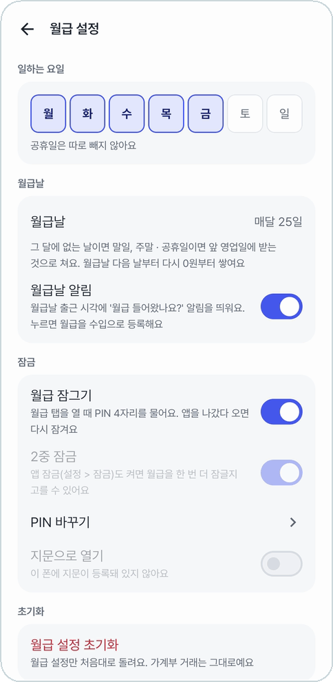
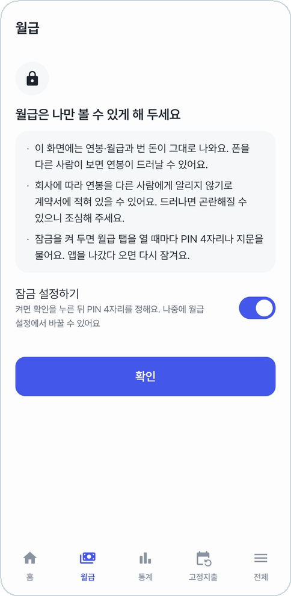
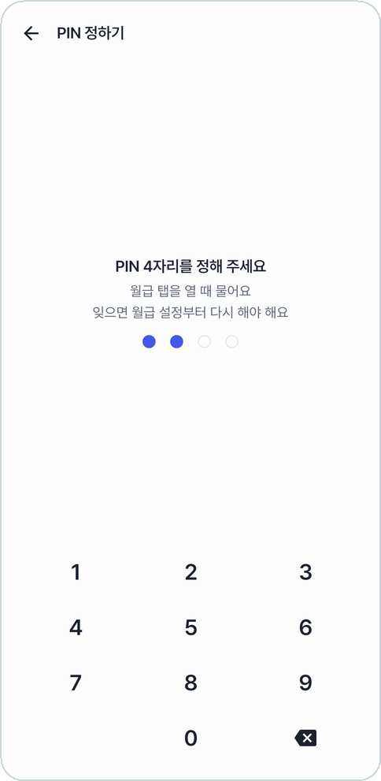
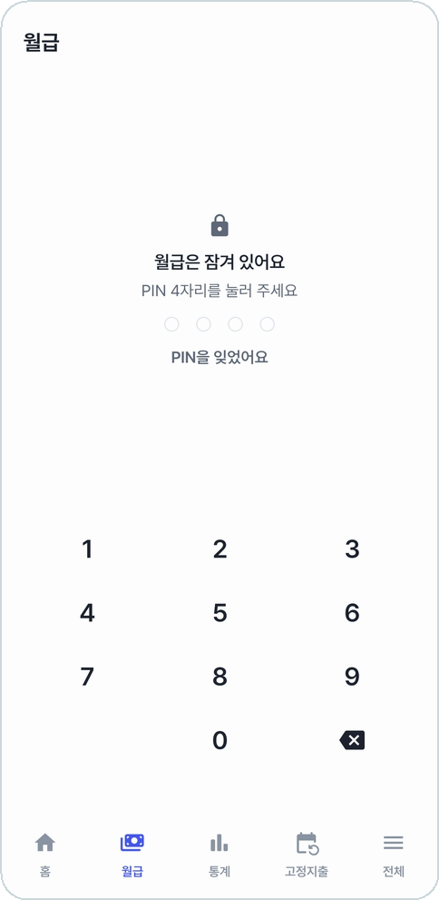

# 월급

연봉이나 월급과 출퇴근 시간을 정해 두면, 일하는 동안 오늘 번 돈이 **초마다** 올라간다.
점심시간은 빼고 센다. 쓴 돈을 '몇 분 일한 값'으로도 보여 준다.

<table>
<tr>
<td align="center" width="50%">
 
<b>오늘 번 돈 · 월급날부터 번 돈 · 올해 번 돈</b>
</td>
<td align="center" width="50%">
 
<b>쓴 돈을 벌려면 얼마나 일해야 하는지</b>
</td>
</tr>
</table>

## 보이는 것

- **오늘 번 돈**: 출근부터 지금까지 번 돈. 옆에 1초·1시간에 버는 돈(₩/s · ₩/h), 아래에 출근~퇴근 막대.
- **오늘 쓴 돈**: 오늘 번 돈의 몇 %를 썼는지.
- **월급날부터 번 돈**: 지난 월급날 다음 날부터 지금까지. 이번 월급의 몇 %를 벌었는지 막대로 보여 준다. 월급날 퇴근 시각에 딱 월급이 된다.
- **올해 번 돈**: 1월 1일부터. 올해 입사했다면 입사일부터 센다.
- **시급 두 줄**: 실제로 일한 시간으로 나눈 시급(주휴수당 포함)과, 세전 월급을 한 달 소정근로시간(주 40시간이면 209시간)으로 나눈 통상시급. 둘이 얼마나 다른지 나란히 본다.
- **월급날까지 N일**: 월급날이 주말이나 공휴일이면 앞 영업일에 받는 것으로 본다.
- **최근 내역**: 최근에 쓴 돈마다 평균 시급으로 '약 35분'처럼 일한 시간을 붙인다.

실수령 월급을 적어 두면 쌓이는 돈과 월급날 등록 금액은 실수령으로, 통상시급은 세전으로 센다.

## 월급 설정

오른쪽 위 톱니바퀴.

<table>
<tr>
<td align="center" width="50%">
 
<b>세전 연봉·월급, 실수령, 입사일, 근무 시간</b>
</td>
<td align="center" width="50%">
 
<b>일하는 요일, 월급날, 월급날 알림, 잠금</b>
</td>
</tr>
</table>

- **급여**: 월급이나 연봉(12로 나눠 한 달로 본다) 세전 금액, 실수령 월급(선택)
- **입사일**: 입사일 전은 번 돈으로 치지 않는다
- **근무 시간**: 출근·퇴근, 점심시간 빼기(켜면 점심 동안은 안 쌓인다)
- **일하는 요일**: 공휴일은 따로 빼지 않는다
- **월급날**: 매달 N일. 그 달에 없는 날이면 말일
- **월급날 알림**: 월급날 출근 시각에 '월급 들어왔나요?' 알림을 띄운다. 누르면 월급이 채워진 수입 등록창이 열린다. 이미 '급여'로 적어 뒀으면 다시 묻지 않는다
- **월급 설정 초기화**: 월급 설정만 처음대로. 가계부 거래는 그대로다

## 잠금

연봉은 남에게 보이면 곤란할 수 있어서 월급 탭만 따로 잠근다.

<table>
<tr>
<td align="center" width="33%">
 
<b>처음 열면 잠글지 묻는다</b>
</td>
<td align="center" width="33%">
 
<b>PIN 4자리를 정한다</b>
</td>
<td align="center" width="33%">
 
<b>앱을 나갔다 오면 다시 잠긴다</b>
</td>
</tr>
</table>

- PIN 4자리나 지문으로 연다. 5번 틀리면 30초 동안 못 누른다.
- 월급이 보이는 동안은 최근 앱 화면 미리보기에도 남기지 않는다.
- PIN을 잊으면 **PIN을 잊었어요**로 월급 설정과 잠금을 지우고 다시 정한다. 가계부 거래는 그대로다.
- [앱 잠금](settings.md#잠금)도 켜 두면, 앱을 연 뒤 월급 탭에서 PIN을 한 번 더 물을지(**2중 잠금**) 고른다.
- 홈 내역의 급여 거래는 가리지 않는다. 잠그는 건 월급 탭과 월급 설정이다.

---

[← 이전: 내역](history.md) · [목차](../../README.md#메뉴별-안내) · [다음: 통계 →](statistics.md)
