# 전체 · 설정

## 전체

아래 메뉴 맨 오른쪽. 앱의 모든 메뉴가 모여 있다. 아래 메뉴에 있는 메뉴는 그 탭으로 바뀌고, 없는 메뉴는 뒤로 가기가 달린 화면으로 열린다.
오른쪽 위 톱니바퀴가 **설정**이다.

<table>
<tr>
<td align="center" width="50%">
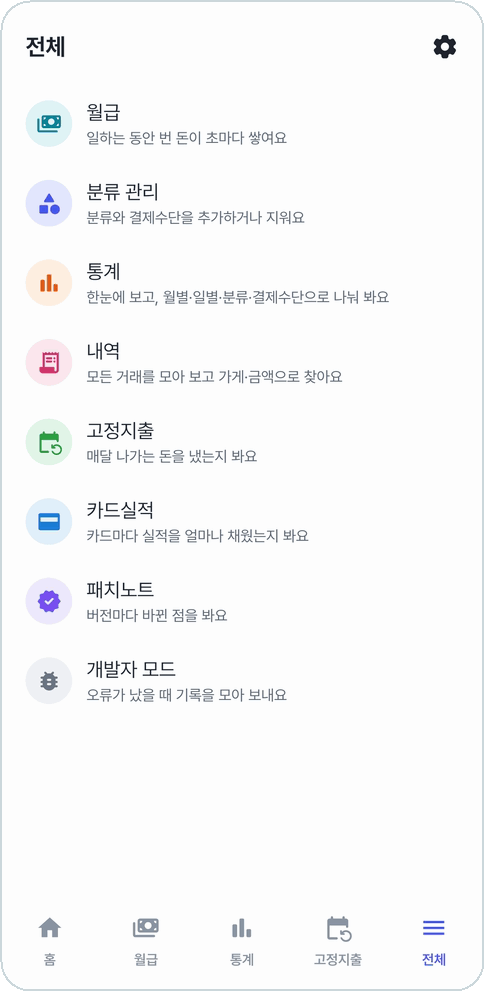 
<b>월급 · 분류 관리 · 통계 · 내역 · 고정지출 · 카드실적 · 패치노트 · 개발자 모드</b>
</td>
<td align="center" width="50%">
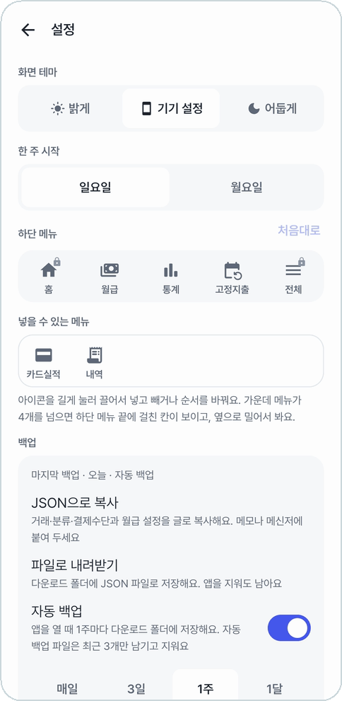 
<b>화면 테마 · 한 주 시작 · 하단 메뉴 · 백업</b>
</td>
</tr>
</table>

## 화면 테마 · 한 주 시작

- **화면 테마**: 밝게 · 기기 설정 · 어둡게. 기기 설정이면 폰의 다크 모드를 따른다([어두운 테마](#어두운-테마)).
- **한 주 시작**: 일요일이나 월요일. 홈 달력과 통계의 요일별 하루 평균이 따른다.

## 하단 메뉴

아래 메뉴에 무엇을 어떤 순서로 둘지 정한다. **아이콘을 길게 눌러 끌어서** 넣고 빼고 옮긴다.

<table>
<tr>
<td align="center" width="50%">
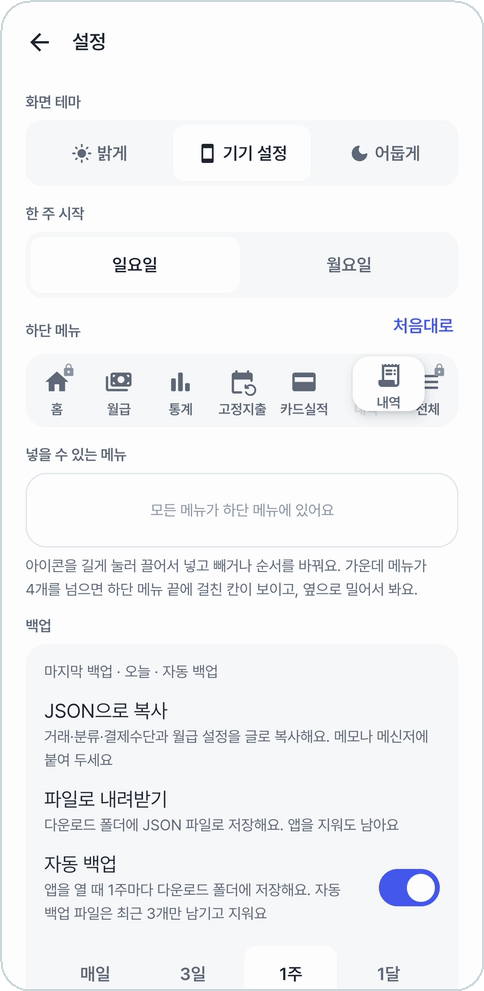 
<b>'넣을 수 있는 메뉴'에서 끌어다 놓는다</b>
</td>
<td align="center" width="50%">
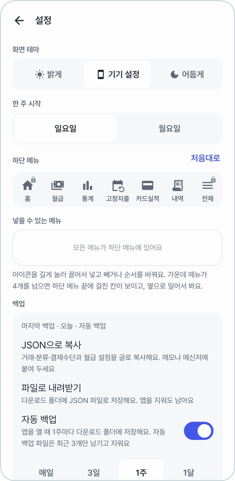 
<b>홈과 전체는 늘 양 끝</b>
</td>
</tr>
</table>

- 처음 차림은 **홈 · 월급 · 통계 · 고정지출 · 전체**다. 카드실적과 내역은 넣을 수 있는 메뉴에 있다.
- 칸 수에 제한이 없다. 가운데 메뉴가 4개를 넘으면 홈과 전체 사이를 **옆으로 밀어** 본다. 다음 메뉴가 가장자리에 흐리게 걸쳐 보이고, 걸친 메뉴를 누르면 그 메뉴로 간다.
- **처음대로**로 되돌린다.

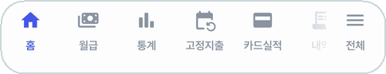 
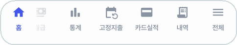 
<b>가운데 메뉴가 6개일 때. 옆으로 밀면 가려진 메뉴가 나온다</b>

## 백업

- 맨 위에 **마지막 백업**이 언제였는지(오늘 · 어제 · N일 전, 어떤 방법으로) 보인다.
- **JSON으로 복사**: 거래·분류·결제수단과 월급 설정을 글로 복사한다. 메모나 메신저에 붙여 둔다.
- **파일로 내려받기**: 다운로드 폴더에 `동계부-백업-날짜.json`으로 저장한다. 앱을 지워도 남는다.
- **자동 백업**: 정한 주기(매일 · 3일 · 1주 · 1달)마다 앱을 열 때 다운로드 폴더에 저장한다. 처음엔 1주마다이고, 자동 백업 파일은 최근 3개만 남긴다.

화면 테마·자동 기능 설정과 결제 알림 목록은 백업에 담지 않는다.

## 복원

<table>
<tr>
<td align="center" width="40%">
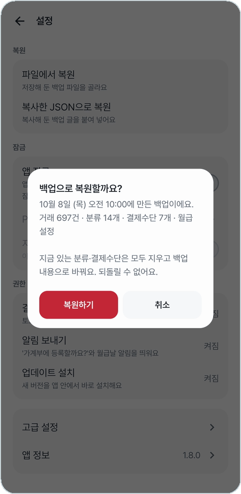 
<b>무엇이 담긴 백업인지 먼저 보여 준다</b>
</td>
<td width="60%">

- **파일에서 복원**: 저장해 둔 백업 파일을 고른다.
- **복사한 JSON으로 복원**: 복사해 둔 백업 글을 붙여 넣는다.

지금 데이터를 백업 내용으로 **통째로 바꾼다**(합치지 않는다).
바꾸기 전에 지금 데이터를 `…-복원전.json` 파일로 먼저 저장해 둔다(고급 설정에서 끌 수 있다).

</td>
</tr>
</table>

## 잠금

<table>
<tr>
<td align="center" width="40%">
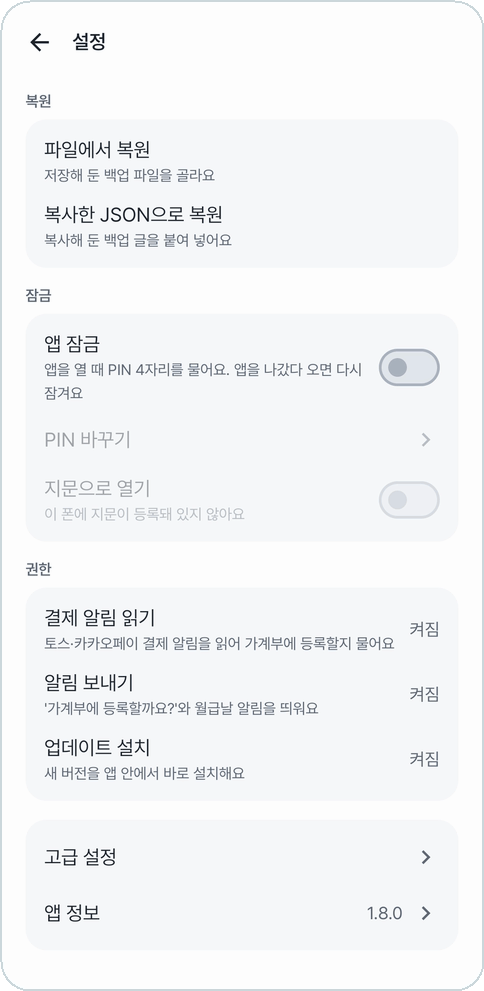 
<b>복원 · 잠금 · 권한 · 고급 설정 · 앱 정보</b>
</td>
<td width="60%">

- **앱 잠금**: 앱을 열 때 PIN 4자리를 묻는다. 앱을 나갔다 오면 다시 잠긴다.
- **지문으로 열기**: 폰에 지문이 등록돼 있으면 켤 수 있다.
- PIN을 잊으면 폰의 화면 잠금(PIN·패턴 등)으로 확인한 뒤 앱 잠금을 끈다.
- 월급 탭만 따로 잠그는 건 [월급 잠금](salary.md#잠금)이다.

**권한**: 결제 알림 읽기 · 알림 보내기 · 업데이트 설치가 켜져 있는지 보고, 꺼져 있으면 눌러서 바로 켜러 간다.

</td>
</tr>
</table>

## 고급 설정

<table>
<tr>
<td align="center" width="50%">
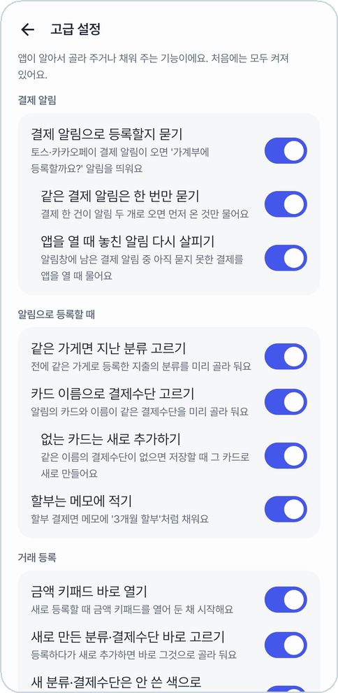 
<b>앱이 알아서 하는 일을 하나씩 켜고 끈다</b>
</td>
<td align="center" width="50%">
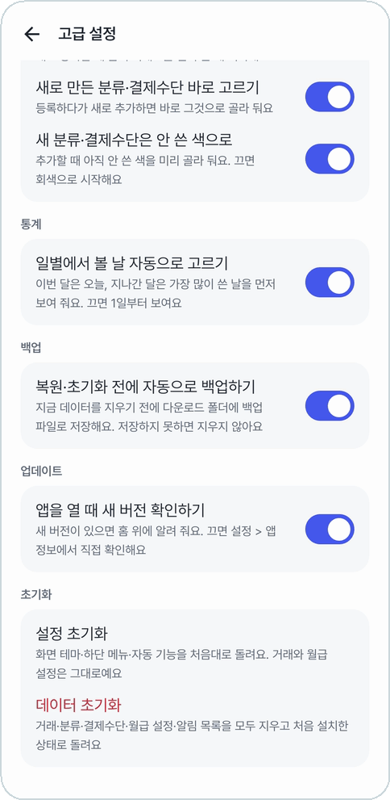 
<b>통계 · 백업 · 업데이트 · 초기화</b>
</td>
</tr>
</table>

| 묶음 | 스위치 |
|---|---|
| 결제 알림 | 결제 알림으로 등록할지 묻기 · 같은 결제 알림은 한 번만 묻기 · 앱을 열 때 놓친 알림 다시 살피기 |
| 알림으로 등록할 때 | 같은 가게면 지난 분류 고르기 · 카드 이름으로 결제수단 고르기 · 없는 카드는 새로 추가하기 · 할부는 메모에 적기 |
| 거래 등록 | 금액 키패드 바로 열기 · 새로 만든 분류·결제수단 바로 고르기 · 새 분류·결제수단은 안 쓴 색으로 |
| 통계 | 일별에서 볼 날 자동으로 고르기 |
| 백업 | 복원·초기화 전에 자동으로 백업하기 |
| 업데이트 | 앱을 열 때 새 버전 확인하기 |

처음에는 모두 켜져 있다. 맨 아래에서 초기화한다.

- **설정 초기화**: 화면 테마·하단 메뉴·자동 기능을 처음대로. 거래와 월급 설정은 그대로다.
- **데이터 초기화**: 거래·분류·결제수단·월급 설정·알림 목록을 지우고 처음 설치한 상태로.

## 앱 정보와 업데이트

<table>
<tr>
<td align="center" width="40%">
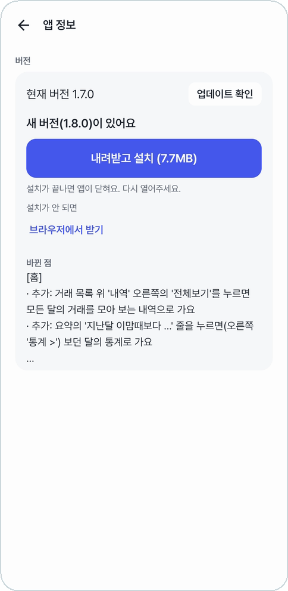 
<b>새 버전이 있으면 바로 받아 설치</b>
</td>
<td width="60%">

- 지금 버전과 **업데이트 확인**.
- 새 버전이 있으면 **내려받고 설치**로 앱 안에서 바로 설치한다. 크기와 바뀐 점도 보여 준다.
- 설치가 안 되면 **브라우저에서 받기**로 받아 설치한다.
- 앱을 열 때마다 새 버전을 확인하고, 있으면 [홈 맨 위](home.md#새-버전-알림)에 알린다.

갤럭시는 **자동 차단**이 켜져 있으면 스토어 밖 앱의 설치·업데이트를 막는다. 업데이트할 때만 잠깐 꺼야 한다.

</td>
</tr>
</table>

## 패치노트 · 개발자 모드

<table>
<tr>
<td align="center" width="40%">
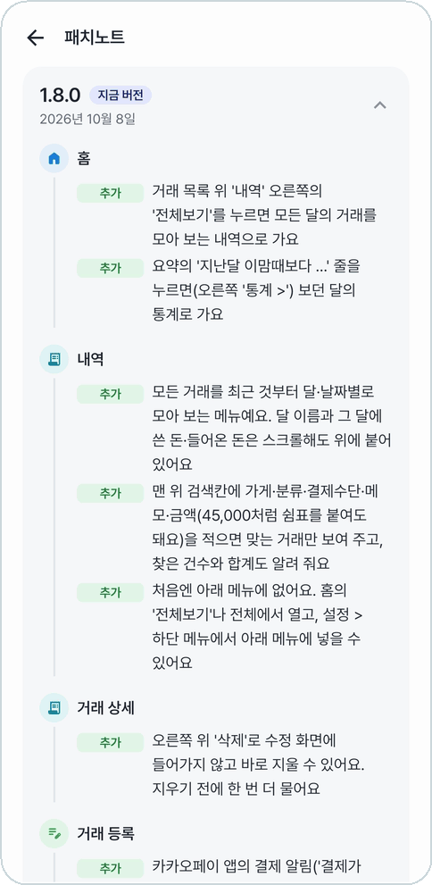 
<b>버전마다 메뉴별로 바뀐 점</b>
</td>
<td width="60%">

**패치노트**: 버전마다 무엇이 추가·개선·수정됐고 어떤 오류를 고쳤는지 메뉴별로 본다. 처음엔 가장 최근 버전만 펼쳐져 있다.

**개발자 모드**: 오류가 났을 때 켜고 같은 일을 한 번 더 해 본 뒤, 쌓인 기록을 복사해서 보낸다.
처음엔 꺼져 있고, 켜 두는 동안 오류와 결제 알림 처리 기록이 쌓인다. 끄면 쌓인 기록을 모두 지운다.

</td>
</tr>
</table>

## 어두운 테마

<table>
<tr>
<td align="center" width="33%">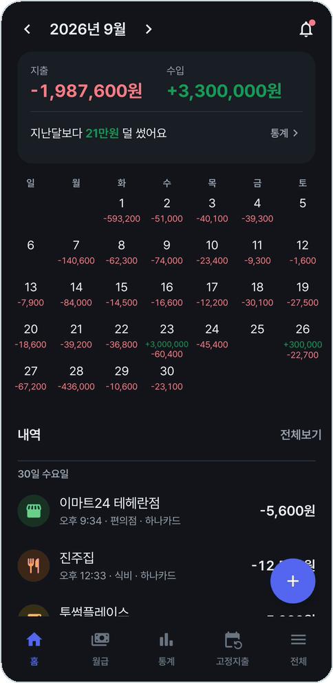</td>
<td align="center" width="33%">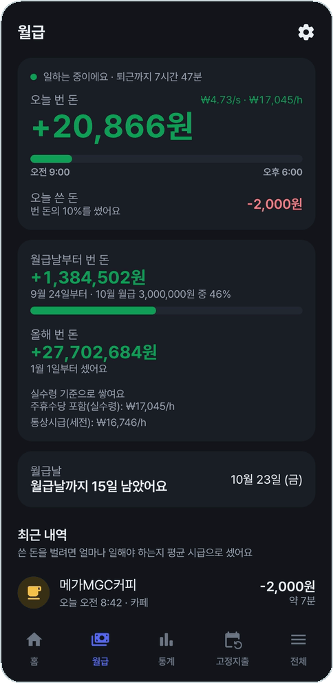</td>
<td align="center" width="33%">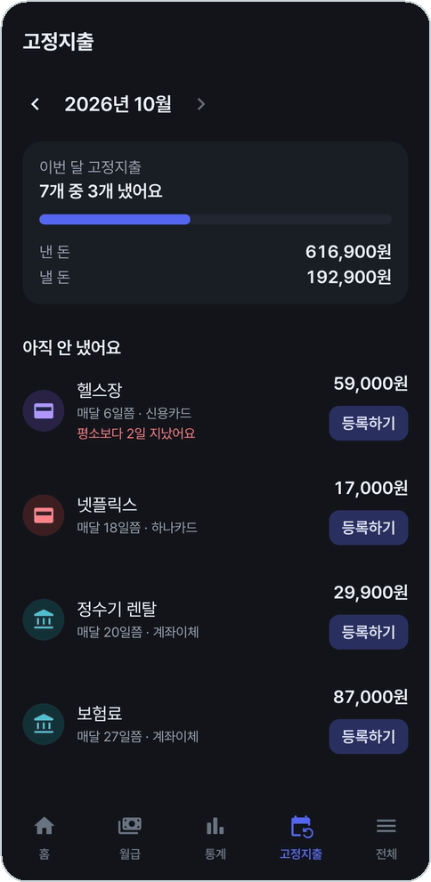</td>
</tr>
<tr>
<td align="center" width="33%">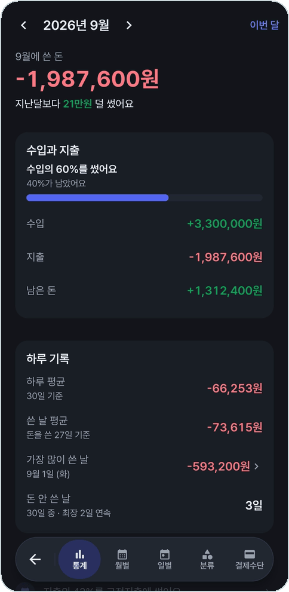</td>
<td align="center" width="33%">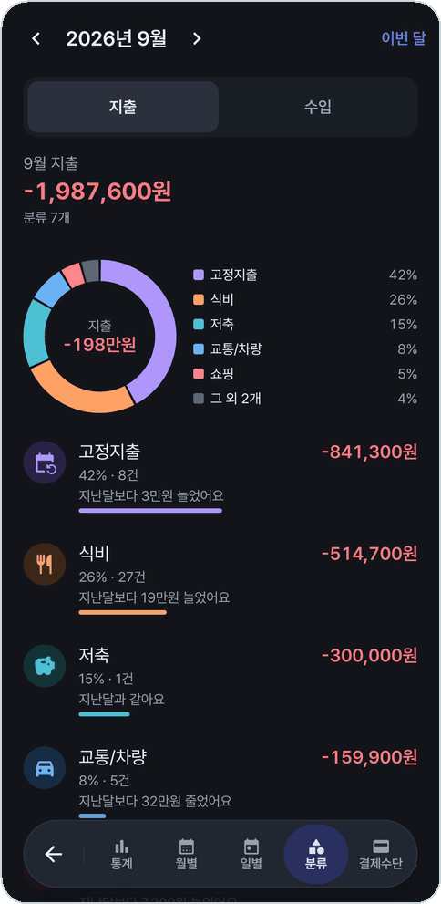</td>
<td></td>
</tr>
</table>

---

[← 이전: 분류 관리](categories.md) · [목차](../../README.md#메뉴별-안내)
