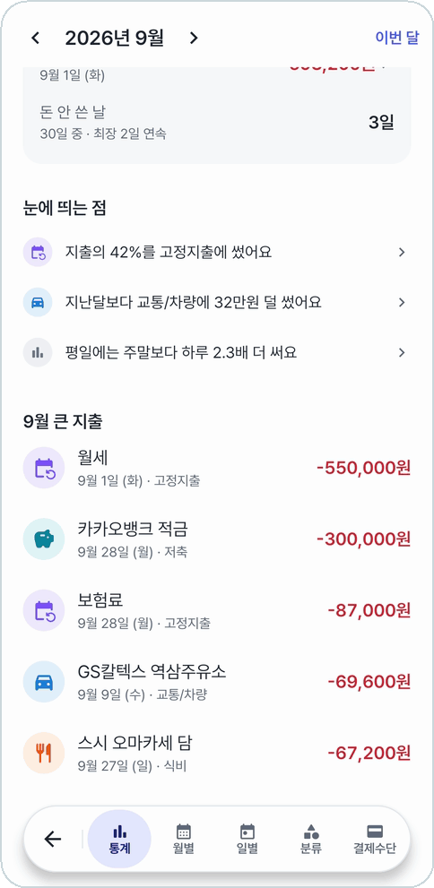
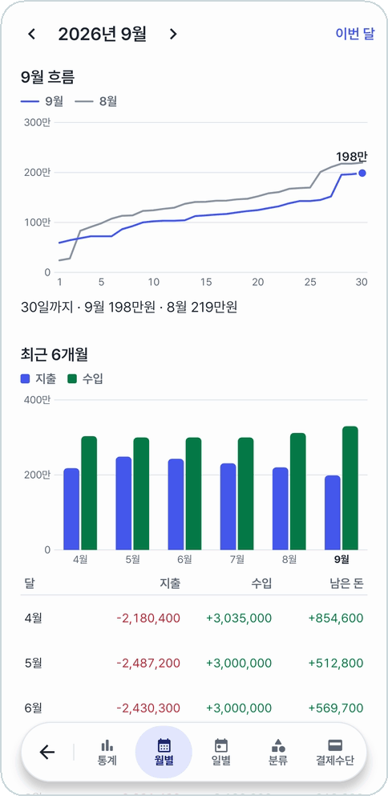
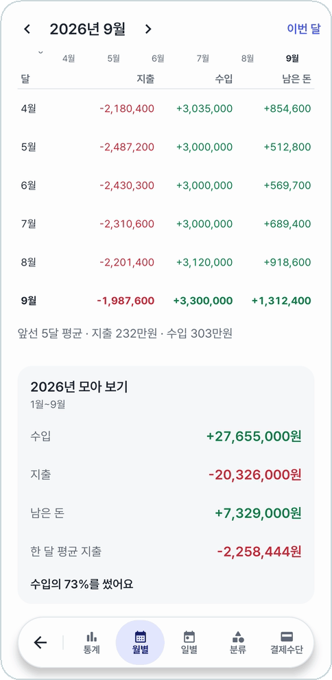
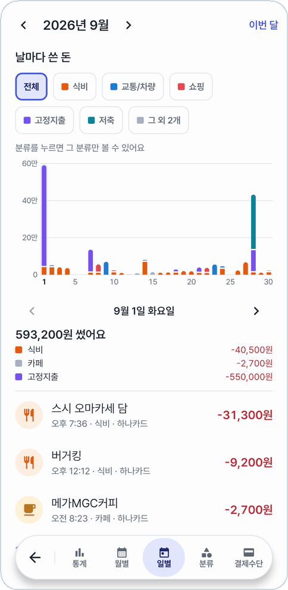
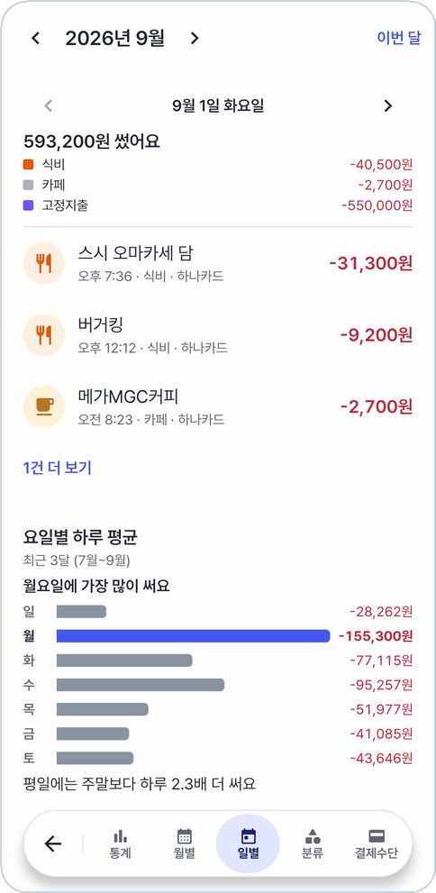
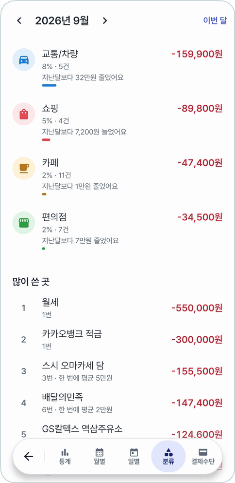
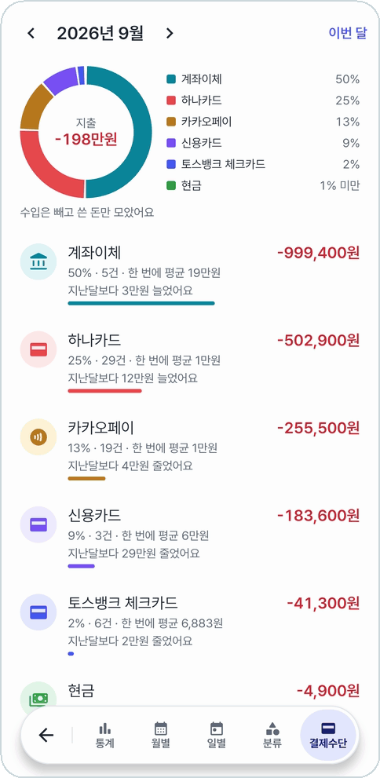
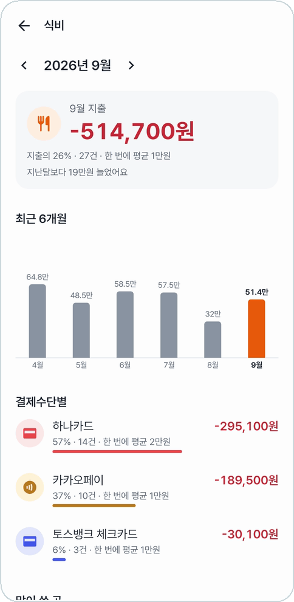
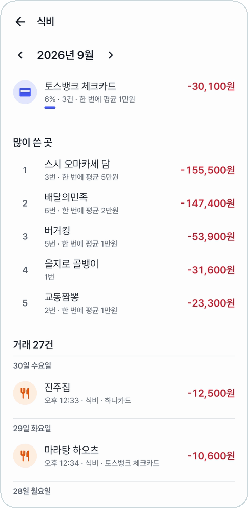

# 통계

아래 메뉴의 **통계**를 누르면 아래에 둥근 메뉴가 떠오른다. 첫 칸 **통계**에서 한 달을 한눈에 보고,
**월별 · 일별 · 분류 · 결제수단**으로 나눠 본다. 맨 위 **‹ ›** 로 달을 넘기고, **이번 달**로 돌아온다.

지출은 -(빨강), 수입은 +(초록)으로 적는다.

## 통계 (한눈에)

<table>
<tr>
<td align="center" width="50%">
 
<b>쓴 돈 · 수입과 지출 · 하루 기록</b>
</td>
<td align="center" width="50%">
 
<b>눈에 띄는 점 · 그 달 큰 지출</b>
</td>
</tr>
</table>

- **쓴 돈**과 지난달(이맘때)보다 얼마 더·덜 썼는지
- **수입과 지출**: 수입의 몇 %를 썼고 얼마 남았는지
- **하루 기록**: 하루 평균, 돈을 쓴 날 평균, 가장 많이 쓴 날, 돈 안 쓴 날(가장 길게 이어진 날 수)
- **눈에 띄는 점**: '지출의 42%를 고정지출에 썼어요', '평일에는 주말보다 하루 2.3배 더 써요' 같은 것. 누르면 그 자리로 간다
- **큰 지출**: 그 달 가장 큰 지출 순서

## 월별

<table>
<tr>
<td align="center" width="50%">
 
<b>이번 달 흐름(지난달과 함께) · 최근 6개월</b>
</td>
<td align="center" width="50%">
 
<b>달마다 지출·수입·남은 돈 · 올해 모아 보기</b>
</td>
</tr>
</table>

- **흐름**: 그 달 쓴 돈이 날마다 쌓이는 선. 지난달 선을 같이 그려 같은 날 견준다
- **최근 6개월**: 지출·수입 막대와 표, 앞선 5달 평균
- **올해 모아 보기**: 1월부터 수입·지출·남은 돈, 한 달 평균 지출

## 일별

<table>
<tr>
<td align="center" width="50%">
 
<b>날마다 쓴 돈을 분류 색으로 쌓아서</b>
</td>
<td align="center" width="50%">
 
<b>고른 날의 거래 · 요일별 하루 평균</b>
</td>
</tr>
</table>

- 위의 분류 칩을 누르면 그 분류만 남긴다
- 막대나 **‹ ›** 로 날을 고르면 그날 분류별 금액과 거래가 아래에 나온다
- **요일별 하루 평균**: 어느 요일에 가장 많이 쓰는지

## 분류 · 결제수단

<table>
<tr>
<td align="center" width="33%">
 
<b>분류별 비율과 순위</b>
</td>
<td align="center" width="33%">
 
<b>지난달 대비 · 많이 쓴 곳</b>
</td>
<td align="center" width="33%">
 
<b>결제수단별 비율과 한 번에 평균</b>
</td>
</tr>
</table>

- **분류**: 지출·수입을 나눠 도넛과 순위로. 건수, 지난달보다 얼마 늘고 줄었는지, 많이 쓴 곳 순위
- **결제수단**: 어느 카드·계좌로 얼마나 냈는지, 한 번에 평균 얼마인지

## 상세

분류나 결제수단 줄을 누르면 그것만 모아 본다.

<table>
<tr>
<td align="center" width="50%">
 
<b>최근 6개월 · 결제수단별</b>
</td>
<td align="center" width="50%">
 
<b>많이 쓴 곳 · 그 달 거래</b>
</td>
</tr>
</table>

---

[← 이전: 월급](salary.md) · [목차](../../README.md#메뉴별-안내) · [다음: 고정지출 →](fixed-expenses.md)
