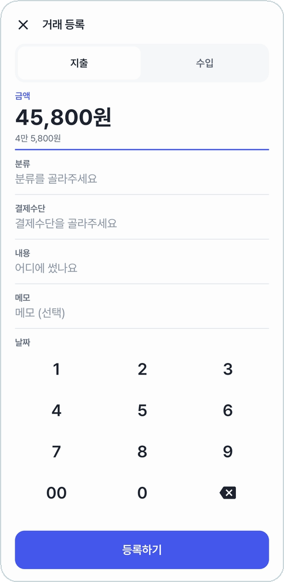
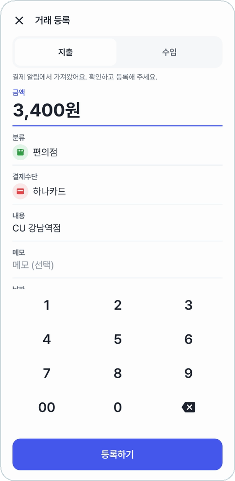
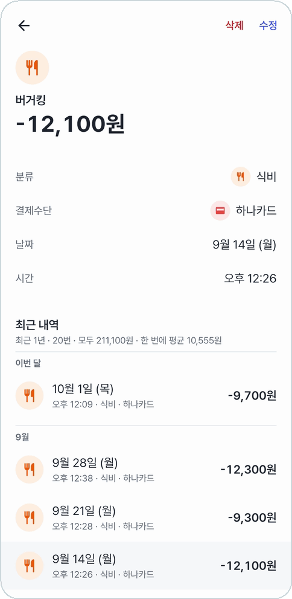
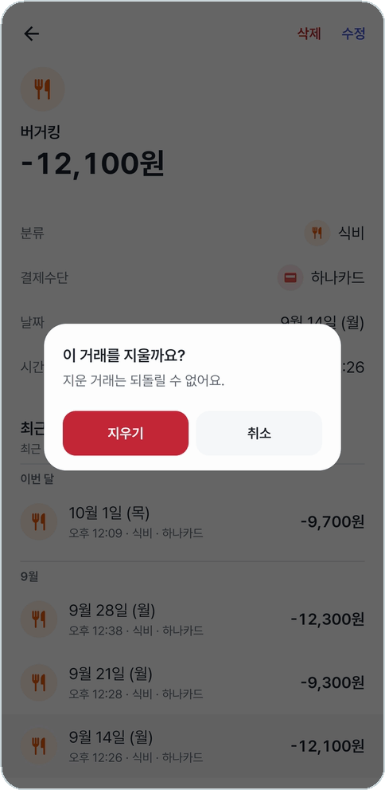

# 거래 등록 · 상세

결제 알림으로 오지 않는 거래(현금, 계좌이체, 알림이 안 오는 카드)는 홈의 **+** 로 직접 적는다.
적은 거래는 누르면 상세가 열리고, 거기서 고치거나 지운다.

## 거래 등록

<table>
<tr>
<td align="center" width="50%">
 
<b>금액 아래에 만·억 단위로 끊어 1원까지</b>
</td>
<td align="center" width="50%">
 
<b>금액은 앱 안 키패드로</b>
</td>
</tr>
</table>

- 위에서 **지출 / 수입**을 고른다.
- **금액**은 등록창을 열자마자 키패드가 뜬다. 1만원이 넘으면 아래에 '4만 5,800원'처럼 끊어 읽어 준다.
- **분류·결제수단**은 아이콘 표에서 고른다. 표 끝의 **+** 로 그 자리에서 새로 만들 수 있다.
- **내용**(어디에 썼는지), **메모**(선택), **날짜**, **시간**. 메모 말고는 모두 채워야 등록된다.
- 결제 알림이나 [고정지출의 등록하기](fixed-expenses.md#등록하기)로 열면 칸이 미리 채워져 있다.

## 거래 상세

<table>
<tr>
<td align="center" width="50%">
 
<b>같은 곳에서 쓴 내역을 1년까지 모아 본다</b>
</td>
<td align="center" width="50%">
 
<b>오른쪽 위 '삭제'는 한 번 더 묻는다</b>
</td>
</tr>
</table>

- 홈·내역·통계의 거래 줄을 누르면 열린다. 금액, 분류, 결제수단, 날짜, 시간, 메모를 한눈에 본다.
- 아래 **최근 내역**은 같은 가게에서 쓴 거래를 최근 1년까지 달별로 모은 것이다. 몇 번 썼는지, 모두 얼마인지, 한 번에 평균 얼마인지도 알려 준다. 지금 보고 있는 거래는 바탕색이 다르다.
- 오른쪽 위 **수정**은 등록창을 열고, **삭제**는 한 번 더 물은 뒤 지운다.

---

[← 이전: 홈](home.md) · [목차](../../README.md#메뉴별-안내) · [다음: 내역 →](history.md)
